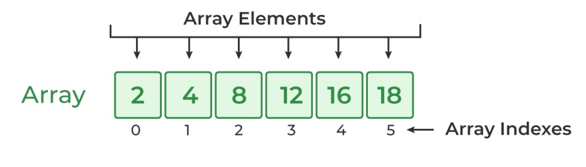

# Content/Content

### Concept

In this section, we will introduce another data type: dynamic arrays.

Arrays are linear data structures that can store a fixed or dynamic size of elements of the same data types.

For example, here is an array of *unsigned integers*. 



- Metaphor
    
    Dynamic arrays are used to regulate a list of elements. For example, if you have a lot of NFTs, we could use dynamic arrays to store those NFTs. Whenever I need to do something about my NFT, I go to my NFTs array. 
    
    ```solidity
    struct NFT {
      id: uint;
      name: string;
    }
    NFT[] myNFT;
    ```
    
- Real Use Case
    
    ***ERC1155*** is a multi-token standard that allows for the creation, transfer, and management of multiple token types within a single *contract*. This standard is an extension of the ERC20 and ERC721 standards and allows for a wide variety of token types, including fungible, semi-fungible, and non-fungible tokens. 
    
    One of the key features of ***ERC1155*** is the ability to perform batch operations, such as minting, transferring, and burning multiple tokens of different types in a single transaction. 
    
    Here is an example of a real-world use case for dynamic arrays in the ***ERC1155*** contract:
    
    **Batch Balances Querying**: In the ***ERC1155*** contract code, one of the functions is ***balanceOfBatch***, which retrieves the balances of multiple token types for multiple accounts. The function takes two dynamic arrays as input, `address[]` ******`memory` ***[accounts](https://github.com/OpenZeppelin/openzeppelin-contracts/blob/9e3f4d60c581010c4a3979480e07cc7752f124cc/contracts/token/ERC1155/ERC1155.sol#L76C4-L76C35)*** and `uint256[]` ******`memory` ***[ids](https://github.com/OpenZeppelin/openzeppelin-contracts/blob/9e3f4d60c581010c4a3979480e07cc7752f124cc/contracts/token/ERC1155/ERC1155.sol#L77)***, and returns a dynamic array `uint256[] memory` ***[batchBalances](https://github.com/OpenZeppelin/openzeppelin-contracts/blob/9e3f4d60c581010c4a3979480e07cc7752f124cc/contracts/token/ERC1155/ERC1155.sol#L83)***.
    
    ```solidity
    function balanceOfBatch(
        address[] memory accounts,
        uint256[] memory ids
    ) public view virtual returns (uint256[] memory) {
        if (accounts.length != ids.length) {
            revert ERC1155InvalidArrayLength(ids.length, accounts.length);
        }
    
        uint256[] memory batchBalances = new uint256[](accounts.length);
    
        for (uint256 i = 0; i < accounts.length; ++i) {
            batchBalances[i] = balanceOf(accounts.unsafeMemoryAccess(i), ids.unsafeMemoryAccess(i));
        }
    
        return batchBalances;
    }
    ```
    
    In this *function*, the dynamic array ***[accounts](https://github.com/OpenZeppelin/openzeppelin-contracts/blob/9e3f4d60c581010c4a3979480e07cc7752f124cc/contracts/token/ERC1155/ERC1155.sol#L76C4-L76C35)*** and ***[ids](https://github.com/OpenZeppelin/openzeppelin-contracts/blob/9e3f4d60c581010c4a3979480e07cc7752f124cc/contracts/token/ERC1155/ERC1155.sol#L77)*** are expected to have the same length, which specifies the number of balance queries to be made. The *function* then initializes a new dynamic array ***[batchBalances](https://github.com/OpenZeppelin/openzeppelin-contracts/blob/9e3f4d60c581010c4a3979480e07cc7752f124cc/contracts/token/ERC1155/ERC1155.sol#L83)of***  of the same length. It iterates through each account and token ID in the input arrays and fills the ***[batchBalances](https://github.com/OpenZeppelin/openzeppelin-contracts/blob/9e3f4d60c581010c4a3979480e07cc7752f124cc/contracts/token/ERC1155/ERC1155.sol#L83)*** array with the corresponding token balances. The ***[batchBalances](https://github.com/OpenZeppelin/openzeppelin-contracts/blob/9e3f4d60c581010c4a3979480e07cc7752f124cc/contracts/token/ERC1155/ERC1155.sol#L83)*** array is then returned to the caller.
    
    This *function* is useful in scenarios where an application needs to query the balances of multiple tokens for multiple accounts in a single call, which can significantly reduce the number of blockchain transactions needed for this operation. It also demonstrates the practical application of dynamic arrays in the ***ERC1155*** *contract*.
    

### Documentation

A dynamic array is defined by the type of its elements followed by square brackets without a specific size. 

```solidity
//elementType[] arrayName;
uint256[] uintArr;
```

### FAQ

- What are dynamic arrays?
    
    In Solidity, an array can be either **fixed** or **dynamic** in size. A dynamic array is an array with a flexible length, i.e., the size of the array can be modified during runtime. 
    
- How are arrays stored in data locations?
    
    Arrays are stored in **contiguous** and **adjacent** memory locations. 
    

# Example/Example

```solidity
// SPDX-License-Identifier: MIT
pragma solidity ^0.8.0;

contract ArrayExample {
  uint256[] uintArr;
  string[] stringArr;
}
```
