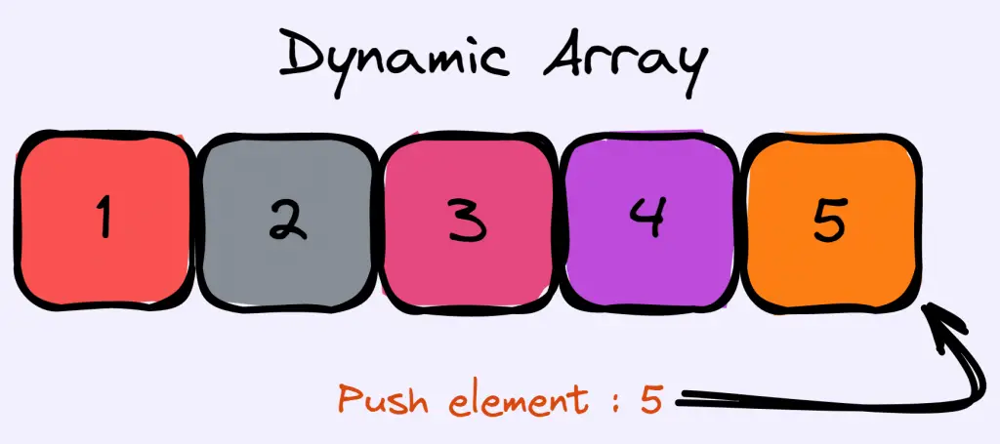

# Content/Content

### Concept

In this section, we will introduce an important method that operates on dynamic arrays: the push method.

The push method is a *built-in function* in Solidity that allows you to append an element to the end of a dynamic arrays, effectively increasing its length by one.



- Metaphor
    
    Imagine you're a stamp collector and you have a binder to store your stamps. Each stamp is unique, and you place them one by one in the binder, filling up the pages from left to right. Whenever you get a new stamp, you add it to the next available space in the binder. Over time, your collection grows and you continue to add more stamps to the binder.
    
    In this metaphor, the binder represents the dynamic arrays, and each stamp is an element. When you push a new stamp into the binder, you're adding it to the next available space, which corresponds to the end of the dynamic arrays in Solidity.
    
- Real Use Case
    
    Continuing from our previous discussion on the ***ERC20VotesLegacyMock*** *contract*, let's further explore how the push operation is employed and used.
    
    In the ***ERC20VotesLegacyMock*** *contract*, the dynamic array plays a crucial role in keeping a historical record of voting power changes. This feature is implemented through the `[_writeCheckpoint](https://github.com/OpenZeppelin/openzeppelin-contracts/blob/618304cc01e718cbdd87059ce2978b748c15050f/contracts/mocks/token/ERC20VotesLegacyMock.sol#L228C1-L230C19)` *function*, which uses the push operation to add new checkpoints to the array.
    
    ```solidity
    function _writeCheckpoint(
        Checkpoint[] storage ckpts,
        function(uint256, uint256) view returns (uint256) op,
        uint256 delta
    ) private returns (uint256 oldWeight, uint256 newWeight) {
        ...
    		ckpts.push(
               Checkpoint({fromBlock: SafeCast.toUint32(block.number), votes: SafeCast.toUint224(newWeight)})
            );
    		...
    }
    ```
    
    The use of dynamic arrays and the push operation in this *contract* facilitates efficient tracking of voting power changes over time. This real use case demonstrates how dynamic arrays and the push operation can be employed in Solidity to create powerful and complex systems like voting and delegation in token-based ecosystems.
    

### Documentation

You can use the push method to add a value to the end of an array. Just write `.push(value)` after the array's name.

```solidity
//arrayName.push(value);
uintArr.push(5);
```

### FAQ

- Can I use the "push" *function* on a fixed-size array?
    
    No, you cannot use the push *function* on fixed-size arrays in Solidity. It only works with dynamic arrays.
    

# Example/Example

```solidity
// SPDX-License-Identifier: MIT
pragma solidity ^0.8.0;

contract ArrayPushExample {
  uint[] uintArr;

  function addElement(uint newValue) public {
    uintArr.push(newValue);
  }
}
```
