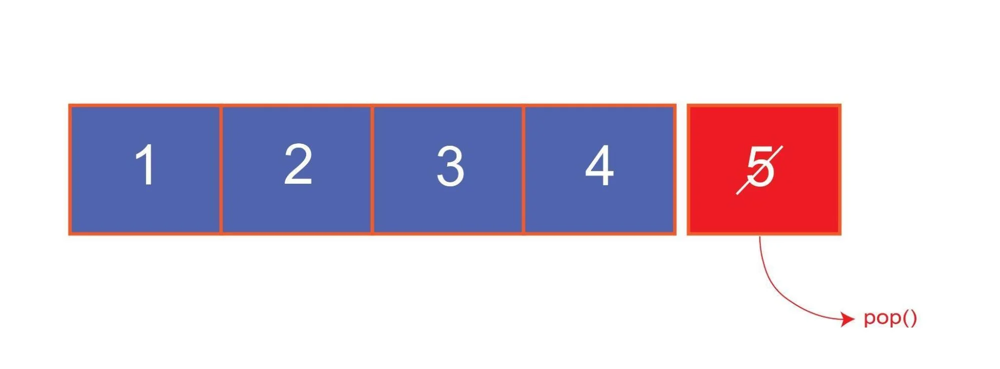

# Content/Content

### Concept

In this section, we will introduce another essential method that operates on dynamic arrays: the pop method.

The pop method is a *built-in function* in Solidity that allows you to remove the last element from a dynamic array, effectively reducing its length by one.



- Metaphor
    
    Continuing from our previous discussion on the stamp collection metaphor, let's explore the pop operation with a dynamic array. Recall that we have a binder to store our stamps, and each stamp is unique. We've placed the stamps in the binder one by one, filling up the pages from left to right.
    
    Now, suppose we want to create space for new stamps. We would start by removing the stamp on the last page of the binder, at the far right. After carefully taking it out, we'd continue removing stamps in reverse order, from right to left, until we have the desired amount of space.
    
    In this metaphor, the pop operation corresponds to removing stamps from the last available space in the binder. In the context of a dynamic array in Solidity, the pop operation allows us to manage elements by removing them from the end of the array, one by one, as needed.
    
- Real Use Case
    
    The ***ERC721Enumerable*** *contract* extends the basic ERC721 standard with additional functionalities that allow for the enumerability of all token IDs in the *contract*, as well as all token IDs owned by each account. It uses a dynamic array to track all token IDs, and the ***_allTokens*** and ***_ownedTokens*** arrays are pivotal for this purpose.
    
    The pop operation is used in this *contract* within the ***[_removeTokenFromAllTokensEnumeration](https://github.com/OpenZeppelin/openzeppelin-contracts/blob/9e3f4d60c581010c4a3979480e07cc7752f124cc/contracts/token/ERC721/extensions/ERC721Enumerable.sol#L160)*** *private function*. This *function* is called when a token needs to be removed from the total token list, and it employs the swap-and-pop strategy to prevent gaps in the array and ensure efficient deletion.
    
    ```solidity
    function _removeTokenFromAllTokensEnumeration(uint256 tokenId) private {
        uint256 lastTokenIndex = _allTokens.length - 1;
        uint256 tokenIndex = _allTokensIndex[tokenId];
    
        uint256 lastTokenId = _allTokens[lastTokenIndex];
    
        _allTokens[tokenIndex] = lastTokenId; // Move the last token to the slot of the to-delete token
        _allTokensIndex[lastTokenId] = tokenIndex; // Update the moved token's index
    
        // This also deletes the contents at the last position of the array
        delete _allTokensIndex[tokenId];
        _allTokens.pop();
    }
    ```
    
    In this *function*, the token to be deleted is swapped with the last token in the ***_allTokens*** array. The last token's index is updated accordingly, and then the pop operation is used to remove the last token (previously swapped) from the array.
    
    This real use case demonstrates how dynamic array and pop operation can be employed in Solidity to implement more advanced features.
    

### Documentation

You can use the pop method to remove the last value from an array. Just write `.pop()` after the array's name.

```solidity
//arrayName.pop();
uintArr.pop();
```

### FAQ

- What happens when I pop an element from an empty array?
    
    If you attempt to pop an element from an empty array, Solidity will throw a runtime exception. It's essential to check the length of the array before using the pop *function* to avoid this error.
    

# Example/Example

```solidity
// SPDX-License-Identifier: MIT
pragma solidity ^0.8.0;

contract ArrayPopExample {
  uint[] uintArr;

  function addElement(uint newValue) public {
    uintArr.push(newValue);
  }

  function removeElement() public {
    uintArr.pop();
  }
}
```
