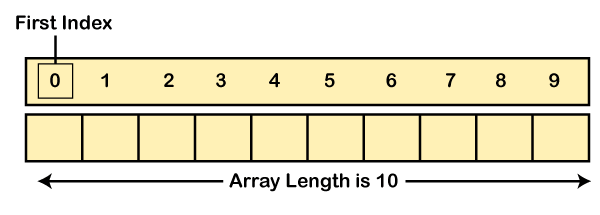

# Content/Content

### Concept

In this section, we will introduce an essential property that relates to dynamic arrays: the length property.

The length property allows developers to check the number of elements currently stored in an array.



- Metaphor
    
    In the context of our stamp collection binder metaphor, the length of the dynamic array corresponds to the number of stamps in the binder. Just like counting the stamps gives you the total number of stamps in your collection, accessing the length of the dynamic array tells you how many elements are in it.
    
    As you add stamps to the binder, the number of stamps increases, and similarly, when you push elements into the dynamic array, its length increases. Conversely, when you remove stamps from the binder, the total count decreases. Likewise, when you pop elements from the dynamic array, its length decreases.
    
    The length of the dynamic array is a useful tool for managing your collection. It lets you keep track of the total elements in the array, making it easier to add new items or prevent removal when it's empty.
    
- Real Use Case
    
    Continuing our exploration of the ***ERC721Enumerable*** *contract* that we discussed in our last session, let's dive deeper into how the dynamic array length is utilized in this *contract*.
    
    The ***ERC721Enumerable*** contract is an extension of the ERC721 *contract* that adds enumerability of all token IDs in the *contract* as well as all token IDs owned by each account. One of the key features in this *contract* is the implementation of *functions* that allow you to query the total supply of tokens and retrieve a specific token by index.
    
    **Total Supply of Tokens:** The ***[totalSupply](https://github.com/OpenZeppelin/openzeppelin-contracts/blob/9e3f4d60c581010c4a3979480e07cc7752f124cc/contracts/token/ERC721/extensions/ERC721Enumerable.sol#L57C6-L57C6)*** *function* gives you the total number of tokens that have been minted. This is implemented using the length of the ***_allTokens*** dynamic array.
    
    ```solidity
    function totalSupply() public view virtual returns (uint256) {
        return _allTokens.length;
    }
    ```
    
    **Retrieve Token by Index:** The ***[tokenByIndex](https://github.com/OpenZeppelin/openzeppelin-contracts/blob/9e3f4d60c581010c4a3979480e07cc7752f124cc/contracts/token/ERC721/extensions/ERC721Enumerable.sol#L67)*** *function* allows you to retrieve a specific token by its index. This *function* checks if the provided index is within the bounds of the ***_allTokens*** dynamic array, and then returns the token at that index.
    
    ```solidity
    function tokenByIndex(uint256 index) public view virtual returns (uint256) {
        if (index >= totalSupply()) {
            revert ERC721OutOfBoundsIndex(address(0), index);
        }
        return _allTokens[index];
    }
    ```
    
    These functionalities showcase how the length property of a dynamic array is utilized to efficiently manage the enumeration of tokens in the ***ERC721Enumerable*** *contract*. This real use case highlights the importance of dynamic arrays and their length property in building sophisticated token management systems in the world of Ethereum blockchain and *smart contracts*.
    

### Documentation

You can use the length property to determine the number of elements in an array. Simply append the `.length` keyword after the array's name.

```solidity
//arrayName.length;
uint length = uintArr.length;
```

### FAQ

- When should we use the length property?
    - We can determine if an array is empty by checking if its length is zero.
    - When attempting to access an element at a specific index, we can first check the array's length to prevent indexing errors due to exceeding the array's bounds.

# Example/Example

```solidity
// SPDX-License-Identifier: MIT
pragma solidity ^0.8.0;

contract ArrayLengthExample {
  uint[] uintArr;

  function addElement(uint newValue) public {
    uintArr.push(newValue);
  }

  function getArrayLength() public view returns (uint) {
    return uintArr.length;
  }
}
```
