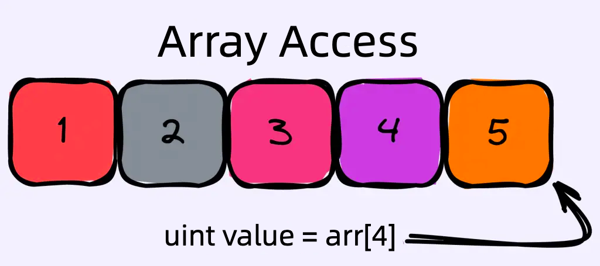

# Content/Content

### Concept

In the previous sections, we learned about push, pop, and length operations on dynamic arrays in Solidity. In this section, we will discuss another critical operation: array element access.

Accessing an array element means retrieving the value stored at a specific index in the array.



- Metaphor
    
    Imagine that a well-known artist has launched a new NFT project on OpenSea(a digital art trading platform). The project consists of a collection of unique NFTs, each with different attributes. These NFTs are stored in an array maintained by the project's *smart contract*, where each NFT can be identified by its unique index, starting from zero.
    
    Now, suppose you have minted one of these NFTs, and by doing so, you have become the owner of this NFT with a unique ID in the array. Let's consider two scenarios where we might need to access elements within an array in our NFT collection:
    
    - **Displaying your NFT**: When you want to display your new NFT on OpenSea, the platform accesses the array using your NFT ID. This allows OpenSea to retrieve its attributes, such as name, rarity, and other unique traits, to showcase on the platform.
    - **Transferring your NFT**: To transfer your NFT to another user, the smart contract uses the NFT's ID to access its details in the array. This allows the smart contract to confirm your ownership and update the information with the new owner's details.
- Real Use Case
    
    Continuing from our previous discussion on the ***ERC721Enumerable*** *contract*, let's delve into the real usage of dynamic array access in Solidity. Here, we focus on the ***[tokenOfOwnerByIndex](https://github.com/OpenZeppelin/openzeppelin-contracts/blob/9e3f4d60c581010c4a3979480e07cc7752f124cc/contracts/token/ERC721/extensions/ERC721Enumerable.sol#L48C11-L48C11)*** *function*, which allows users to query for a specific token ID based on its owner's address and the index of the token within the owner's collection of tokens.
    
    ```solidity
    function tokenOfOwnerByIndex(address owner, uint256 index) public view virtual returns (uint256) {
        if (index >= balanceOf(owner)) {
            revert ERC721OutOfBoundsIndex(owner, index);
        }
        return _ownedTokens[owner][index];
    }
    ```
    
    This function provides direct access to a token's ID using an index-based lookup in the ***_ownedTokens***, which stores a dynamic array of token IDs for each owner's *address*. It's a common practice in Solidity *contracts* to use *mappings* with dynamic arrays to organize and track data for specific entities, like token owners in this case.
    
    In this real use case, the dynamic array access operation allows users to easily retrieve a specific token's ID within an owner's collection without having to iterate through the entire list. This demonstrates how dynamic arrays and index-based access can be used efficiently in Solidity to provide organized, easily accessible data within a *smart contract*.
    

### Documentation

```solidity
//arrayName[index];
uint value = uintArr[0];
```

You can access a specific element in an array by writing the array's name followed by the index in square brackets (**`[]`**).

### FAQ

- Can I use variables as indices to access elements in a dynamic array?
    
    Yes, you can use variables as indices as long as they are of an integer type (like *uint256*). However, be careful to ensure that the variable's value is within the bounds of the array to avoid exceptions.
    

# Example/Example

```solidity
// SPDX-License-Identifier: MIT
pragma solidity ^0.8.0;

contract ArrayAccessExample {
  uint[] uintArr;

  function addElement(uint newValue) public {
    uintArr.push(newValue);
  }

  function getFirstElement() public view returns (uint) {
    return uintArr[0];
  }
}
```
