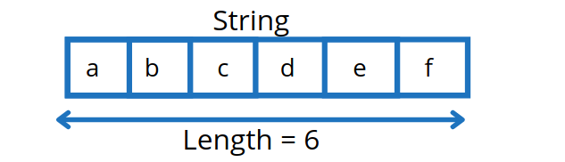

# Content/Content

### Concept

So far we’ve looked at string and string concatenation. In this article, we’re going to learn about string length.

A string is a collection of characters, and the length of a string refers to the number of characters it contains.



- Real Use Case
    
    The ERC721 *contract* is an implementation of the ERC721 NFT Standard. This contract is widely used for creating unique digital assets on the Ethereum blockchain, such as collectibles, art, and virtual real estate. In this *contract*, the string is used to generate token URIs.
    
    ```solidity
    function tokenURI(uint256 tokenId) public view virtual returns (string memory) {
        _requireMinted(tokenId);
    
        string memory baseURI = _baseURI();
        return bytes(baseURI).length > 0 ? string.concat(baseURI, tokenId.toString()) : "";
    }
    ```
    
    In the ***tokenURI*** *function* of the `ERC721` *contract*, the length property of strings is used to check if the ***[baseURI](https://github.com/OpenZeppelin/openzeppelin-contracts/blob/9e3f4d60c581010c4a3979480e07cc7752f124cc/contracts/token/ERC721/ERC721.sol#L95C1-L95C1)*** is set. If the ***[baseURI](https://github.com/OpenZeppelin/openzeppelin-contracts/blob/9e3f4d60c581010c4a3979480e07cc7752f124cc/contracts/token/ERC721/ERC721.sol#L95C1-L95C1)*** is set (its length is greater than 0), the function concatenates the ***[baseURI](https://github.com/OpenZeppelin/openzeppelin-contracts/blob/9e3f4d60c581010c4a3979480e07cc7752f124cc/contracts/token/ERC721/ERC721.sol#L95C1-L95C1)*** and the ***tokenId*** to generate the full token URI. This URI is typically used to link to metadata about the token, such as its name, description, and image.
    
    This demonstrates how the length property of a string can be used to verify and assist in finishing string operations.
    

### Documentation

Solidity does not provide a length property directly to get the string length. We can convert the string to bytes and then use the length property to get the string length. 

```solidity
//a string variable with a value of hello
string hi = "hello";
//we're converting the string to bytes
//so as to get the length of the characters
uint length = bytes(hi).length;
```

### FAQ

- When will string length be used in general?
    
    String length is used in many situations in Solidity. Some examples: 
    
    - Input validation: When receiving input from external sources such as user input we need to validate the input to ensure that it meets certain requirements.
        
        For example, we may require that a string input is not longer than a certain length. To enforce this requirement, we need to obtain the length of the string input.
        
    - Manipulating strings: We’d like to welcome everyone with a customized welcome message: “Welcome GUA” if my name is GUA. Therefore, we will count the length, cut the last three characters, and then append new names to it.
- Why is knowing the length of a string important when working with strings in Solidity?
    
    The length of a string is an important piece of information that is required in many situations. For example, when we are manipulating strings, we need to know their length to perform operations such as substring concatenation and comparison.
    

# Example/Example

```solidity
//SPDX-License-Identifier: MIT
pragma solidity ^0.8.0;

contract StringLength {
  function getLength(string memory str) public pure returns (uint) {
    bytes memory bytesStr = bytes(str);
    return bytesStr.length;
  }
  string name = "the daughter";
  string testS;
  bytes testB;

  function test() public {
    testS = string.concat(name, "hello");
    //we convert string to bytes and use length
    //to access how many bytes it used to store the string
    // then assign the length of bytes to an uint l
    uint l = bytes(testS).length;
    testB = bytes(testS);
  }
}
```
