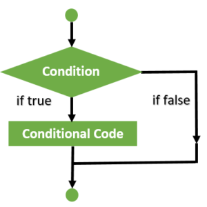

# Content/Content

### Concept

We've explored various Solidity concepts, including variables and functions. Now, we'll enhance our functions with flow control.

In this section, we'll first introduce flow control using the if-else statement, which executes code fragments based on whether a condition is true or false.



- Metaphor
    
    I want to buy a book. If the ***price*** is less than *10* dollars, then I’m okay; otherwise, I wouldn't buy it. if allows the program to make decisions based on certain conditions. In the case of purchasing a book, the program decides whether to execute the purchase based on the ***price*** of the book. 
    
    ```solidity
    if (price <10){
    	//buy the book
    } else{
    	//give up 
    }
    ```
    
- Real Use Case
    
    Continuing from our previous discussion on the ERC20 *contract*, let's delve deeper into how the if-else statement is employed and used.
    
    In the `ERC20` *contract*, the if-else statement plays a pivotal role in handling various scenarios during token transfers. One such instance is in the [***_update***](https://github.com/OpenZeppelin/openzeppelin-contracts/blob/9ef69c03d13230aeff24d91cb54c9d24c4de7c8b/contracts/token/ERC20/ERC20.sol#L245C9-L245C34) *function*, where the if-else statement is used to check whether the ***from*** or ***to*** address is the zero address, and then handle the token transfer accordingly.
    
    ```solidity
    function _update(address from, address to, uint256 value) internal virtual {
        if (from == address(0)) {
            _totalSupply += value;
        } else {
            uint256 fromBalance = _balances[from];
            if (fromBalance < value) {
                revert ERC20InsufficientBalance(from, fromBalance, value);
            }
            unchecked {
                _balances[from] = fromBalance - value;
            }
        }
    
        if (to == address(0)) {
            unchecked {
                _totalSupply -= value;
            }
        } else {
            unchecked {
                _balances[to] += value;
            }
        }
    
        emit Transfer(from, to, value);
    }
    ```
    
    In this function, the if-else statement is used to check whether the ***from*** address is the zero address, which indicates a token minting operation. If it is, the total supply of tokens is increased by the specified value. Similarly, the if-else statement is used to check whether the ***to*** address is the zero address, indicating a token-burning operation. If it is, the total supply of tokens is decreased by the specified value.
    
    This real use case demonstrates how the if-else statement can be employed in Solidity to handle different scenarios and conditions during token transfers, minting, and burning. 
    

### Documentation

```solidity
// if (condition) { code } else { code }
if (value == 10) {
  // code to execute if value is 10
} else {
  // code to execute if value is not 10
}
```

An if-else statement can be defined using the `if` keyword followed by a condition enclosed in parentheses (`()`), and then a code block enclosed in braces `{}`. If the condition is false, the code in the `else` block is executed.

### FAQ

- Can I use multiple conditions in an if-else statement?
    
    You can use the else-if statement to check multiple conditions in an if-else statement. If the first condition is false, the next else-if condition is checked, and so on. If none of the conditions are true, the code inside the else block is executed (if provided).
    
    ```solidity
    // if (condition) { code } else { code }
    if (value == 10) {
      // code to execute if value is 10
    } else if (value == 20) {
      // code to execute if value is 20
    } else {
      // code to execute if value is not 10
    }
    ```
    

# Example/Example

```solidity
// SPDX-License-Identifier: MIT
pragma solidity ^0.8.0;

contract IfElseExample {
  uint value = 10;

  function checkValue() public view returns (string memory) {
    if (value == 10) {
      return "Value is equal to 10";
    } else {
      return "Value is not equal to 10";
    }
  }
}
```
