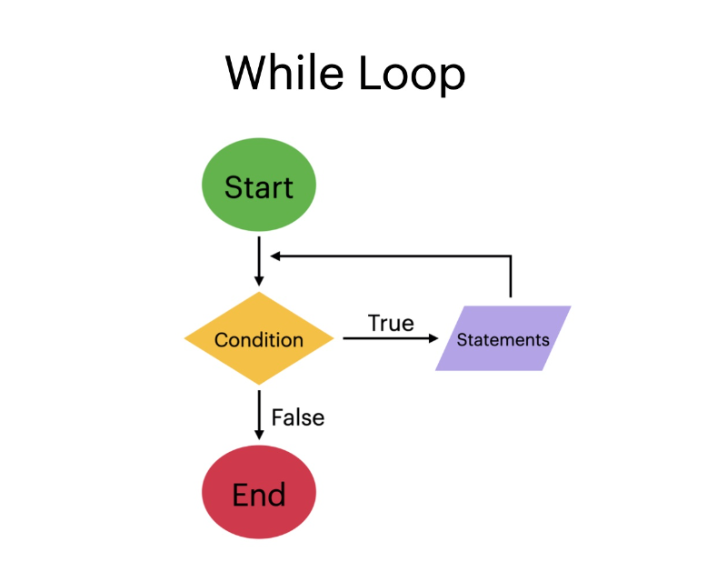

# Content/Content

### Concept

We've already learned about if-else statements for conditional execution. Now, we're going to introduce another construct for controlling program flow: while loops.

A while statement allows for repeated execution of a block of code, as long as a certain condition remains true.



- Metaphor
    
    Imagine you have a bottle of water, and you want to drink it all. Each time you take a sip, you drink a certain amount of water until the bottle is empty. This is where a while loop can be used.
    
    The while loop starts with a full bottle, you take a sip, and then it checks if there's still water left. If there is, you take another sip, repeating this process until the bottle is empty.
    
    ```solidity
    uint water = 500; // initial amount of water in milliliters
    uint sips = 0;
    while (water > 0){
        water -= 30; // each sip is 30 milliliters
        sips++;
    }
    ```
    
    In this code, the loop will continue as long as there's water in the bottle (***water > 0***). With each sip, the amount of water decreases by 30 milliliters, and the count of sips (***sips***) increases by *1*. The loop stops when there's no more water left in the bottle.
    
- Real Use Case
    
    The *Strings* library provides a collection of functions for string operations. It offers various utilities for converting numeric values to strings, comparing strings, and performing other string-related tasks. One of the functions in this library, toString, uses a while loop to convert a *uint256* value to its ASCII string decimal representation.
    
    Let's take a closer look at how the while loop is employed in the ***[toString](https://github.com/OpenZeppelin/openzeppelin-contracts/blob/9e3f4d60c581010c4a3979480e07cc7752f124cc/contracts/utils/Strings.sol#L33)*** *function*:
    
    ```solidity
    
    function toString(uint256 value) internal pure returns (string memory) {
        unchecked {
            uint256 length = Math.log10(value) + 1;
            string memory buffer = new string(length);
            uint256 ptr;
            /// @solidity memory-safe-assembly
            assembly {
                ptr := add(buffer, add(32, length))
            }
            while (true) {
                ptr--;
                /// @solidity memory-safe-assembly
                assembly {
                    mstore8(ptr, byte(mod(value, 10), _HEX_DIGITS))
                }
                value /= 10;
                if (value == 0) break;
            }
            return buffer;
        }
    }
    ```
    
    In this function, the while loop iterates until the value becomes zero. During each iteration, the loop extracts the last digit of the value, converts it to a character, and stores it in the buffer. The value is then divided by 10 to remove the last digit. This process continues until the entire value has been converted to a *string*.
    
    The use of the while loop in this library facilitates efficient conversion of numeric values to strings. This real use case demonstrates how the while loop can be employed in Solidity to create efficient string manipulation functions.
    

### Documentation

```solidity
uint i = 0;
while (i < 10) {
  i++;
  // code to execute for each iteration
}
```

A while loop is defined using the `while` keyword, followed by a condition enclosed in parentheses `()`. The block of code to be executed is enclosed in braces `{}`.

As long as the condition remains true, the code block will keep being executed.

### FAQ

- A while loop can run infinitely if the condition never becomes false.
    
    Yes, that's correct. A while loop will continue to run indefinitely if the condition never becomes false. This can lead to unintended behavior, excessive gas consumption, and even out-of-gas errors in Solidity smart contracts. It's essential to ensure that the loop condition will eventually become false to avoid infinite loops.
    

# Example/Example

```solidity
// SPDX-License-Identifier: MIT
pragma solidity ^0.8.0;

contract WhileLoopExample {
  uint[] public numbers;

  function fillNumbers(uint n) public {
    uint i = 0;
    while (i < n) {
      numbers.push(i);
      i++;
    }
  }

  function getNumbers() public view returns(uint[] memory) {
    return numbers;
  }
}
```
