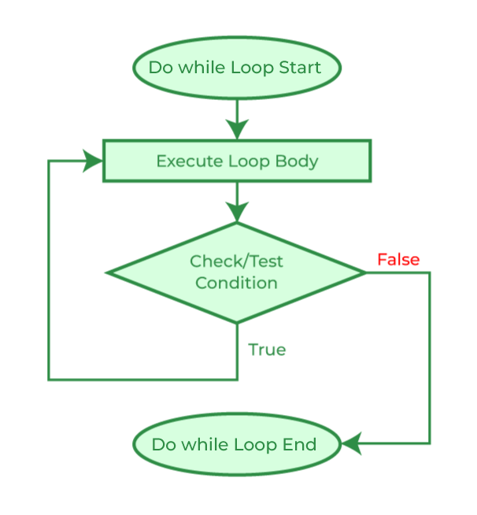

# Content/Content

### Concept

After learning about if-else statements and while loops, we are now going to delve into another control flow construct: do-while loops.

A do-while loop statement enables the repeated execution of a block of code as long as a certain condition remains true. 



- Metaphor
    
    Let's consider the water bottle analogy again. You have a bottle of water, and you want to drink it all. You take a sip without checking if there's any water left. Only after taking a sip, you check if the bottle is empty. This is where a do-while loop can be useful.
    
    ```solidity
    uint water = 500; // initial amount of water in milliliters
    uint sips = 0;
    do {
      water -= 30; // each sip is 30 milliliters
      sips++;
    } while (water > 0);
    ```
    
    In this code, the loop will continue as long as there's water in the bottle (***water > 0***). With each sip, the amount of water decreases by 30 milliliters, and the count of sips (***sips***) increases by *1*. The loop stops when there's no more water left in the bottle.
    
- Real Use Case
    
    do while is rarely used, but if we need to execute a loop logic before evaluating a condition, we need to use this syntax.
    
    ```solidity
    function example() public {
      uint i = 0;
      do {  
        numbers.push(i);
        i++;
      } while (i < 10);  
    }
    ```
    

### Documentation

```solidity
uint i = 0;
do {
  i++;
  // code to execute for each iteration
} while (i < 10);
```

A do-while loop is defined using the `do` keyword, followed by the block of code to be executed enclosed in braces `{}`, and finally the `while` keyword with the condition enclosed in parentheses `()`.

The block of code will be executed at least once and will continue to be executed as long as the condition remains true.

### FAQ

- What is the key difference between a while loop and a do-while loop?
    
    The key difference between a while loop and a do-while loop is that the latter guarantees at least one execution of the code block because it evaluates the condition after executing the code block.
    

# Example/Example

```solidity
// SPDX-License-Identifier: MIT
pragma solidity ^0.8.0;

contract DoWhileLoopExample {
  uint[] public numbers;

  function fillNumbers(uint n) public {
    uint i = 0;
    do {
      numbers.push(i);
      i++;
    } while (i < n);
  }

  function getNumbers() public view returns(uint[] memory) {
    return numbers;
  }
}
```
