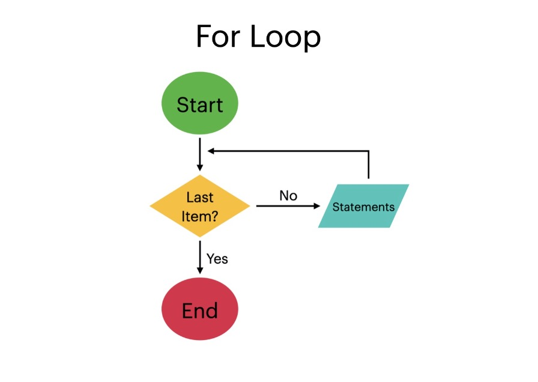

# Content/Content

### Concept

Now, we're going to introduce another powerful tool for controlling the flow of our programs: for loops.

A for loop statement allows for repeated execution of code fragments, like while and do-while. It executes a block of code repeatedly until a certain condition is met.



- Metaphor
    
    Imagine you're a teacher and you have a class of students. You want to calculate the average grade of the class. You'd need to add up each student's grade and then divide by the number of students. This is where a for loop comes in handy.
    
    The for loop starts with the first ***student*** adding their ***grade*** to the ***total***, then moves on to the next ***student***, repeating this process until it has added up the grades of the entire class.
    
    ```solidity
    uint total = 0;
    for (uint i = 0; i < students.length; i++){
      total += students[i].grade;
    }
    uint average = total / students.length;
    ```
    
- Real Use Case
    
    As we have previously introduced, the *Strings* library provides a collection of functions for string operations.
    
    One of the *functions* in the *Strings* library that uses a for loop is the ***[toHexString](https://github.com/OpenZeppelin/openzeppelin-contracts/blob/9e3f4d60c581010c4a3979480e07cc7752f124cc/contracts/utils/Strings.sol#L70C9-L70C55)*** *function*, which converts a *uint256* value to its ASCII *string* hexadecimal representation with fixed length.
    
    ```solidity
    function toHexString(uint256 value, uint256 length) internal pure returns (string memory) {
        uint256 localValue = value;
        bytes memory buffer = new bytes(2 * length + 2);
        buffer[0] = "0";
        buffer[1] = "x";
        for (uint256 i = 2 * length + 1; i > 1; --i) {
            buffer[i] = _HEX_DIGITS[localValue & 0xf];
            localValue >>= 4;
        }
        if (localValue != 0) {
            revert StringsInsufficientHexLength(value, length);
        }
        return string(buffer);
    }
    ```
    
    In this *function*, a for loop is used to iterate through each digit of the hexadecimal representation of the input value. The loop starts from the least significant digit and proceeds to the most significant digit. The loop continues until all digits have been processed.
    
    The for loop provides a concise and efficient way to handle such tasks, making it an essential tool for *smart contract* development.
    

### Documentation

```solidity
for (uint i = 0; i < 10; i++) {
  // code to execute for each iteration
}
```

A for loop can be defined using the `for` keyword, followed by an initialization statement, a condition, and an increment statement. All are enclosed in parentheses `()`. The block of code to be executed is enclosed in braces `{}`.

In this example, `i++` is called the increment operator and is shorthand for i = i + 1. It means that the value of `***i***` is increased by *1*. 

### FAQ

- for VS while
    
    The for and while loop are exactly the same functionally wise, which means everything while can do, for also can do it, and vice versa. The key difference is in code style: for is more structured in a way that it clearly states the initial condition, increment process, and final condition. 
    

# Example/Example

```solidity
// SPDX-License-Identifier: MIT
pragma solidity ^0.8.0;

contract ForLoopExample {
  uint[] public numbers;

  function fillNumbers(uint n) public {
    for (uint i = 0; i < n; i++) {
      numbers.push(i);
    }
  }

  function getNumbers() public view returns(uint[] memory) {
    return numbers;
  }
}
```
