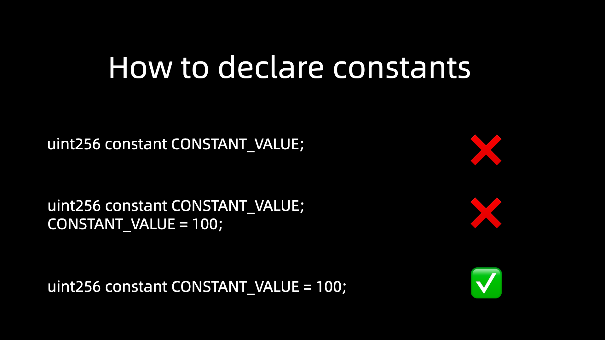

# Content/Content

### Concept

Constant variables in Solidity are *variables* that, once initialized, cannot be changed. This means that the value of a *constant variable* remains the same throughout the execution of a *smart contract*.



- Metaphor
    
    In Solidity, a constant is like a sign that designates a fixed value on a display board—it remains unchanged and can be referenced but not altered throughout the *contract's* operation.
    
- Real Use Case
    
    The following code is in the [***Governor***](https://github.com/OpenZeppelin/openzeppelin-contracts/blob/9ef69c03d13230aeff24d91cb54c9d24c4de7c8b/contracts/governance/Governor.sol#L30C5-L31C91) *contract*. This line of code computes a *hash* ***BALLOT_TYPEHASH*** representing the structure of a ***Ballot*** data type with specific components using the `keccak256` cryptographic *function* in a Solidity *contract*. 
    
    Later this *constant* is used to [verify](https://github.com/OpenZeppelin/openzeppelin-contracts/blob/9ef69c03d13230aeff24d91cb54c9d24c4de7c8b/contracts/governance/Governor.sol#L556C1-L556C116) that the data received actually match this structure and contains a valid signature. 
    
    The ***BALLOT_TYPEHASH*** is declared as a *constant* because its value is calculated based on a specific data structure and is intended to remain unchanged throughout the execution of the *contract*.
    
    ```solidity
    bytes32 public constant BALLOT_TYPEHASH =
            keccak256("Ballot(uint256 proposalId,uint8 support,address voter,uint256 nonce)");
    ```
    

### Documentation

To define a constant, we declare it similarly to how we declare a state variable, but with the `constant` keyword.

```solidity
uint256 constant MAXSUPPLY = 200;
```

<aside>
💡   *Constants* can only be used for the definition of *state variables*.

*Constants* are typically represented in uppercase.

</aside>

### FAQ

- Why use Constants? Or what are the advantages of using constants?
    
    *Constants* are stored directly in the contract’s bytecode, not in storage, which reduces *gas* costs for accessing them. Since the value of *constant variables* is fixed at compile time, they do not consume extra *gas* for computation or storage during the execution of a contract.
    
- When should we use Constants?
    
    When you have a piece of information that is not going to change throughout the execution of the contract, it is best to set it as a constant. It makes your code easier to read and also saves *gas*.
    

# Example/Example

```solidity
pragma solidity ^0.8.17;

contract ConstantsExample {
    address public constant MY_ADDRESS =
        0x777788889999AaAAbBbbCcccddDdeeeEfFFfCcCc;
    uint256 public constant MAXINPUT = 1;

    function input(uint256 num) public pure {
        require(num < MAXINPUT);
    }
}
```
