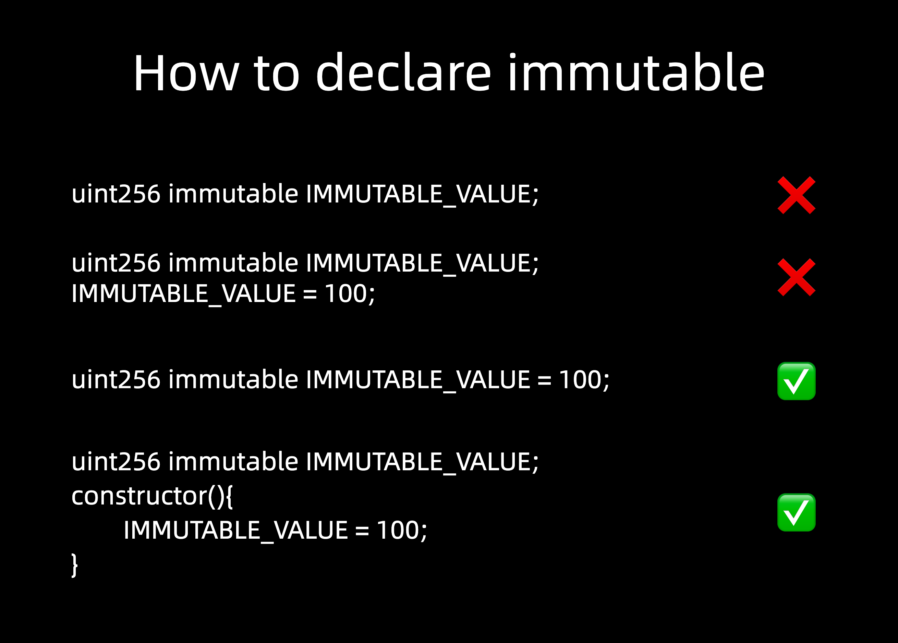

# Content/Content

### Concept

In Solidity, immutable variables, similar to *constants*, have a fixed value. However, unlike constants, *immutables* can also be assigned a value during the *contract* deployment. The values of these variables can be set inside the *constructor* but cannot be modified afterward.



- Metaphor
    
    In Solidity, immutable is like a sealed envelope containing unchangeable contents—the contract properties or data stored within it cannot be altered once the envelope is sealed and deployed on the blockchain.
    
- Real Use Case
    
    In the ***[VestingWallet](https://github.com/OpenZeppelin/openzeppelin-contracts/blob/9ef69c03d13230aeff24d91cb54c9d24c4de7c8b/contracts/finance/VestingWallet.sol#L36)*** contract, this code declares a private variable ***_start*** of type `uint64` in Solidity, and it's marked as *immutable* to indicate that its value is set once during contract deployment and cannot be changed afterward.
    
    ```solidity
    uint64 private immutable _start;
    ```
    

### Documentation

```solidity
uint256 public immutable maxSupply;
```

To define an immutable, we declare it similarly to how we declare a *state variable*, but with the *immutable* keyword.

<aside>
💡 1. *Immutables* can only be used for the definition of *state variables*.
2. *Immutables* are typically represented in uppercase.

</aside>

### FAQ

- When should we use Immutable?
    
    When you have a piece of information that will be the same across the contract, but can vary between deployments, it is best to set it as *immutable*. It makes your code easier to read and also saves *gas*.
    
- Why use Immutable? ****
    
    Immutable variables are stored directly in the contract’s *bytecode*, not in *storage*, which reduces *gas* costs for accessing them. The value of *immutable* variables is substituted at compile time.
    
    *Immutable* variables provide increased security and reliability to Solidity *contracts* by ensuring that data that is supposed to be *constant* cannot be altered during runtime.
    

# Example/Example

```solidity
// SPDX-License-Identifier: GPL-3.0
pragma solidity ^0.8.17;

contract ImmutableExample {
  address public immutable MY_ADDRESS;
  uint public immutable MY_UINT;

  constructor(address _myAddress, uint _myUint) {
    MY_ADDRESS = _myAddress;
    MY_UINT = _myUint;
  }
}
```
