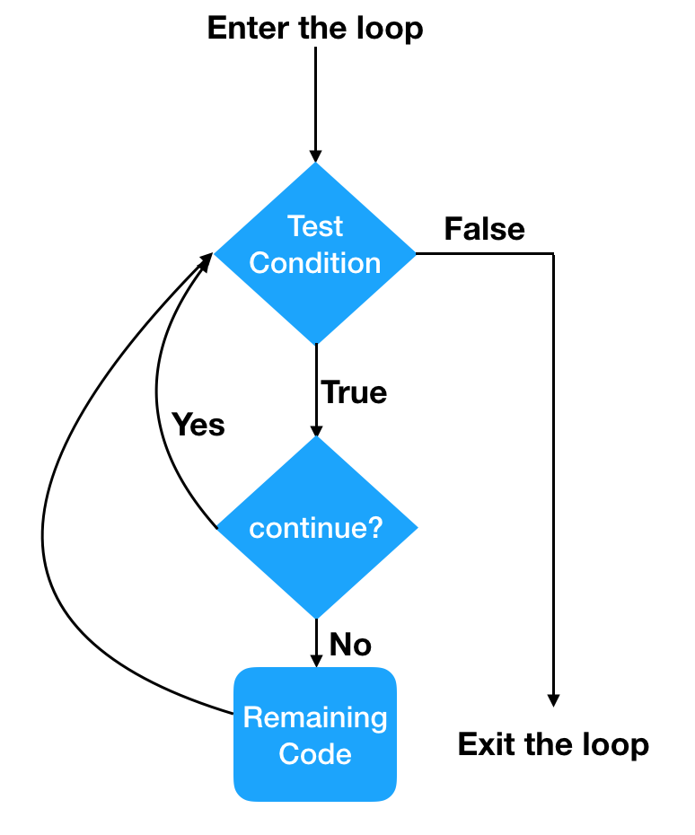

# Content/Content

### Concept

In previous lessons, we mentioned about *constants* and *immutables*. Now we will jump back to loops, and learn another two keywords that might be useful in loops. 

The continue statement in Solidity is used within a loop to skip the remaining code within the current iteration and proceed to the next iteration of the loop.



- Metaphor
    
    Suppose we want to calculate the total cost of an array of books, we would need to iterate through each book and sum up their prices. 
    
    However, suppose we don't want to buy a book priced at *13*, considering it an unlucky number. We would want to skip that book and move on to the next.
    
    *Continue* allows us to skip the following code in the *loop* body for this specific iteration, and immediately starts the next iteration of the loop. 
    
- Real Use Case
    
    In this example, the ***processEvenNumbers*** function processes an array of numbers and returns a new array containing only the even numbers. The *continue* statement is used to skip over odd numbers and proceed to the next iteration of the loop.
    
    ```solidity
    function processEvenNumbers(uint[] memory numbers) public pure returns (uint[] memory) {
            uint[] memory evenNumbers = new uint[](numbers.length);
            uint evenCount = 0;
    
            for (uint i = 0; i < numbers.length; i++) {
                if (numbers[i] % 2 != 0) {
                    continue; // Skip odd numbers
                }
    
                evenNumbers[evenCount] = numbers[i];
                evenCount++;
            }
    
            assembly { mstore(evenNumbers, evenCount) }
            return evenNumbers;
        }
    ```
    
    Here is another example from [Solidity By Example](https://solidity-by-example.org/loop/)  .
    

### Documentation

To skip the rest of the iteration and jump to the condition check again, we simply use the `continue` keyword.

```solidity
for (int a = 0; a < 10; a++) {
  if (a == 5) { continue; }
  //other things to do if a is not 5
}
```

### FAQ

- What is the difference between continue and break?
    
    In summary, *continue* is used to skip the current iteration and move to the next iteration, while `break` is used to exit the loop altogether. They both help control the flow of code execution within loops based on specific conditions.
    

# Example/Example

```solidity
// SPDX-License-Identifier: GPL-3.0
pragma solidity ^0.8.4;
contract Example {
  uint[] prices = [1,2,13,4];

  function countPrice() public view returns(uint) {
    uint totalPrice = 0;

    for (uint i = 0; i < prices.length; i++) {
      if (prices[i] == 13) {
        continue;
      }
      totalPrice += prices[i];
    }

    return totalPrice;
  }
}
```
