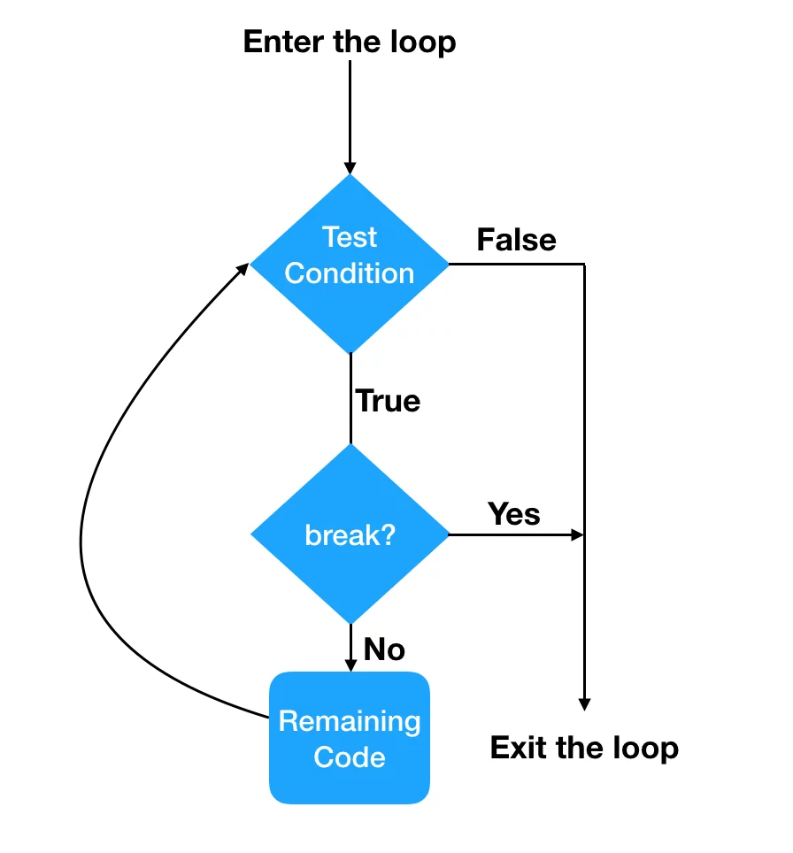

# Content/Content

### Concept

The break statement in Solidity is used within a loop to immediately exit the loop and continue with the next section of code after the loop.



- Metaphor
    
    Same story. Suppose we want to calculate the total cost of an array of books, we would need to iterate through each book and sum up their prices. 
    
    However, I want to stop counting if the total price exceeds *100*.
    
    *Break* allows us to completely terminate the loop when a certain condition is met, and then continue executing the code after the loop.
    
- Real Use Case
    
    In ***[Strings](https://github.com/OpenZeppelin/openzeppelin-contracts/blob/9ef69c03d13230aeff24d91cb54c9d24c4de7c8b/contracts/utils/Strings.sol#L40C1-L40C39)** contract* written by OpenZeppelin, we use `break` to exit the *while loop*. 
    
    ```solidity
    function toString(uint256 value) internal pure returns (string memory) {
        ...        
        while (true) {
            ptr--;
            ...
            value /= 10;
            if (value == 0) break;
        }
    }
    ```
    
    Same [Solidity By Example](https://solidity-by-example.org/loop/)  .
    

### Documentation

To skip the rest of the iteration and terminate the loop, we simply use the `break` keyword.

```solidity
for (int a = 0; a < 10; a++) {
  if (a == 5) { break; }
  //other things to do if a is not 5
}
```

### FAQ

- What is the difference between continue and break?
    
    In summary, *continue* is used to skip the current iteration and move to the next iteration, while *break* is used to exit the loop altogether. They both help control the flow of code execution within loops based on specific conditions.
    

# Example/Example

```solidity
// SPDX-License-Identifier: GPL-3.0
pragma solidity ^0.8.4;
contract Example {
  uint[] prices = [1,2,13,4,200];

  function countPrice() public view returns(uint) {
    uint totalPrice = 0;

    for (uint i = 0; i < prices.length; i++) {
      if (prices[i] == 13) {
        continue;
      }
      if(totalPrice > 200) {
        break;
      }
      
      totalPrice += prices[i];
    }

    return totalPrice;
  }
}
```
