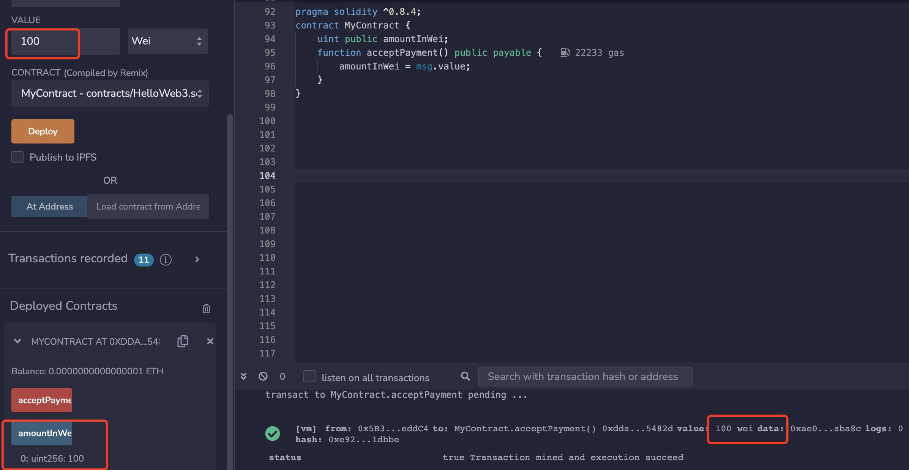

# Content/Content

### Concept

In the previous section, we learned about the *payable function*. In this section, we will learn about `msg.value`.

`msg.value` is a special global variable in Solidity. It represents the amount of wei (not Ether, 1 Ether = 10^18 wei) sent in a transaction. It's commonly used inside `payable` functions to determine how much Ether has been sent.

```solidity
amountInWei = msg.value;
```



- Metaphor
    
    The `msg.value` in a smart contract is akin to the amount handed to a cashier when purchasing a movie ticket, representing the value of Ether sent along with a transaction to access a specific service or functionality within the contract.
    
- Real Use Case
    
    It is still the ***ERC2771Forwarder*** contract just now. Since this *function* expects someone to pass ETH to call, it needs to know the amount of ETH passed by the caller. At this time, *msg.value* is needed to obtain it.
    
    ```solidity
    function executeBatch(
        ForwardRequestData[] calldata requests,
        address payable refundReceiver 
    ) public payable virtual {
        ...
        if (requestsValue != msg.value) {
            revert ERC2771ForwarderMismatchedValue(requestsValue, msg.value);
        }
        ...
    }
    ```
    

### Documentation

`msg.value` is a *global variable* provided by Solidity that contains the amount of Wei sent with the current transaction.

```solidity
function donate() public payable {
  uint amountDonated = msg.value;  
  // amountDonated now holds the amount of Wei sent with the transaction
}
```

### FAQ

- What are the other global variables related to msg, other than msg.value?
    1. `msg.data`: This variable holds the complete calldata of the transaction. It includes the function selector and any arguments passed to the function.
    2. `msg.sig`: This variable holds the first four bytes (function selector) of `msg.data`, representing the function being called in the transaction.
    3. `msg.gas`: This variable holds the amount of gas left for the transaction to execute. Unused gas is refunded after the transaction completes.
    4. `msg.gasprice`: This variable holds the gas price (in wei) that the sender is willing to pay for each unit of gas. It's used to calculate the cost of gas for the transaction.
    5. `msg.origin`: This variable holds the address that originally initiated the transaction, even if it was via another contract. It's considered the ultimate sender.

# Example/Example

```solidity
// SPDX-License-Identifier: GPL-3.0
pragma solidity ^0.8.17;

contract DonationContract {
  uint public totalDonations;

  function donate() public payable {
    totalDonations += msg.value;
    // Update total donations with the amount of wei sent with the transaction
  }
}
```
