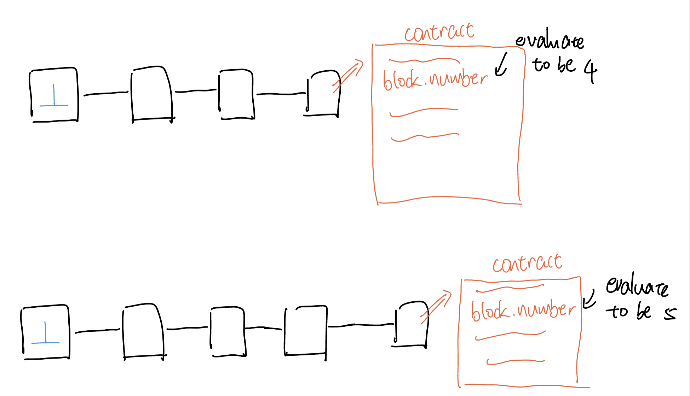

# Content/Content

### Concept

In this unit, we will learn two global variables about block. 

This first one is `block.number`, which provides the number of the current block processing the transaction.



- Metaphor
    
    The `block.number` in Ethereum is like a page number in a continuously growing book, indicating the current position within the blockchain's history and providing a reference point for tracking the sequence of events in the network.
    
- Real Use Case
    
    In OpenZepplin's***[GovernorVotes](https://github.com/OpenZeppelin/openzeppelin-contracts/blob/9ef69c03d13230aeff24d91cb54c9d24c4de7c8b/contracts/governance/extensions/GovernorVotes.sol#L25)*** contract, the ***clock*** function is used to return time. If an exception occurs in `token.clock`, the current block number will be used as the return value.
    
    ```solidity
    function clock() public view virtual override returns (uint48) {
        try token.clock() returns (uint48 timepoint) {
                return timepoint;
        } catch {
            return SafeCast.toUint48(block.number);
        }
    }
    ```
    

### Documentation

`block.number` is a *global variable* in Solidity that indicates the current block's sequential number.

```solidity
function processBlock() public {
  uint currentBlock = block.number;
  // currentBlock now holds the number of the current block
}
```

### FAQ

- How do I simulate or mock `block.number` in tests?
    
    In testing frameworks like Truffle or Hardhat, there are ways to manipulate or fast forward the block number for testing purposes.
    
    In Remix, you could increment the `block.number` by 1 by making changes to contract states. 
    

# Example/Example

```solidity
// SPDX-License-Identifier: GPL-3.0
pragma solidity ^0.8.17;

contract BlockNumberExample {
    uint256 a = 1;

    //the block number increment by 1 at every function call in Remix
		function showCurrentBlock() public returns (uint256) {
        a = a + 1;
        return block.number;
    }
}
```
