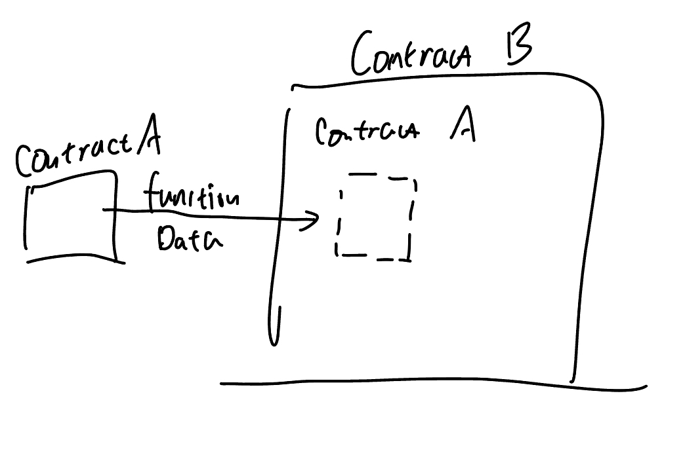

# Content/Content

### Concept

So far, we’ve learnt a lot about variables and *functions* in one contract, but how do *contracts* interact with each other? 

A contract variable in Solidity allows a *contract* to interact with another *contract* on the blockchain by calling its *functions* and accessing its *state variables*. 

- Metaphor
    
    A *contract variable* is like a one-way bridge between two contracts. It allows one to interact with the other, accessing all the information and making *functions* calls in the other *contract*.
    
    
    
- Real Use Case
    
    In OpenZepplin's [***GovernorTimelockControl***](https://github.com/OpenZeppelin/openzeppelin-contracts/blob/9ef69c03d13230aeff24d91cb54c9d24c4de7c8b/contracts/governance/extensions/GovernorTimelockControl.sol#L25) abstract contract, a variable***_timelock*** of type ***[TimelockController](https://github.com/OpenZeppelin/openzeppelin-contracts/blob/9ef69c03d13230aeff24d91cb54c9d24c4de7c8b/contracts/governance/TimelockController.sol#L24)***r is defined.
    
    ```solidity
    abstract contract GovernorTimelockControl is Governor {
        TimelockController private _timelock;
    }
    ```
    

### Documentation

To define a variable of *contract type*, it needs to be declared in the format of `ContractType ContractVariableName`.

```solidity
MyContract mycontract;

//The contract instance needs to be instantiated through new.
mycontract = new MyContract(); 

//It can also be instantiated by specifying an address.
MyContract mycontract = MyContract(contractAddress); 
```

### FAQ

- Why do we need contract variables?
    
    *Contract* variables enable interactions between different contracts deployed on the *Ethereum* blockchain. This is fundamental for building complex decentralized applications (*dApps*), where *contracts* often need to interact with one another.
    
    For example, in a decentralized trading platform, one *contract* could represent a digital asset, and another *contract* could represent the marketplace. The marketplace *contract* would need to interact with the digital asset *contract* to facilitate buying and selling.
    

# Example/Example

```solidity
// SPDX-License-Identifier: MIT
pragma solidity ^0.8.0;

// Contract A
contract ContractA {
    uint256 public data;
}

// Contract B
contract ContractB {
    //Defines a contract type variable of ContractA
    ContractA public contractA;
    ContractA public contractAA;

    constructor(address _contractA) {
        //Instantiate the incoming contract address as the ContractA contract and assign it to the contractA variable
        contractA = ContractA(_contractA);
        contractAA = new ContractA();
    }
}
```
