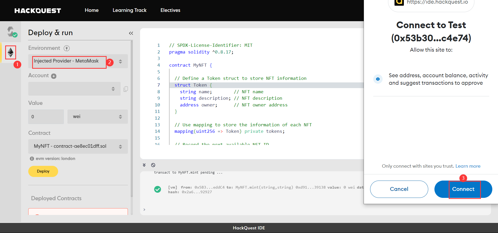

# Content/Deploy on Remix VM


1. Compile the *contract*.
2.  Click on **Deploy** and **confirm** the transaction.
    
    > Check the lesson before if you forget how to deploy.
    > 

# Content/Mint


1. Find the ***mint** function*, and fill in "*first*" in the ***_name*** field.
2. Fill in "*the first NFT we minted*" in the ***_description*** field.
3. Click on "**transact**”.

# Content/Copy address


1. Copy the caller’s address.

# Content/getTokensByOwner


1. Paste the address to the ***_owner*** section.
2. Click on Call.

# Content/Connect Account

> Excellent! *Contract* testing is done, and it's error-free. Now, let's deploy it to the **blockchain**! (Skip if no immediate deployment is needed.)
> 
> 
> Before deployment, connect your wallet. This tutorial uses **MetaMask**, so make sure it's installed in your browser.
> 



1. Click on the second icon on the left.
2.  Connect Metamask.

# Content/Deploy on Mantle

After connecting your wallet, we're set to deploy the *contract* on the **specified network**, here we choose **Mantle**. Make sure your wallet is configured for Mantle, and the connected account in the IDE has enough MNT tokens. (For detailed instructions, check our previous tutorials.)


1. Deploy the ***MyToken.so*l**.
2. Confirm the *transaction*.

# Content/Query Contract

> This is a contract deployed on the blockchain! You can check contract details in the Mantle blockchain explorer.
> 


1. Copy the deployed *contract* address from Deployed *Contracts*.
2. Open the [Mantle Blockchain Explorer](https://explorer.testnet.mantle.xyz/) to query contract details.

# Example/ Code

```solidity
// SPDX-License-Identifier: MIT
pragma solidity ^0.8.17;

contract MyNFT {

  // Define a Token struct to store NFT information
  struct Token {
    string name;        // NFT name
    string description; // NFT description
    address owner;      // NFT owner address
  }

  // Use mapping to store the information of each NFT
  mapping(uint256 => Token) private tokens;

  // Use mapping to store the list of NFT IDs owned by each address
  mapping(address => uint256[]) private ownerTokens;

  // Record the next available NFT ID.
  uint256 nextTokenId = 1;

  // Create an NFT function to create a new NFT and assign it to the caller.
  function mint(string memory _name, string memory _description) public returns (uint256) {
    Token memory newNFT = Token(_name, _description, msg.sender);
    tokens[nextTokenId] = newNFT;
    ownerTokens[msg.sender].push(nextTokenId);
    nextTokenId++;
    return nextTokenId-1;
  }

  //Create a function to get information on a specified NFT
  function getNFT(uint256 _tokenId) public view returns (string memory name, string memory description, address owner) {
    require(_tokenId >= 1 && _tokenId < nextTokenId, "Invalid token ID");
    Token storage token = tokens[_tokenId];
    name = token.name;
    description = token.description;
    owner = token.owner;
  }

  // Get all NFT IDs owned by a specified address
  function getTokensByOwner(address _owner) public view returns (uint256[] memory) {
    return ownerTokens[_owner];
  }
}
```
