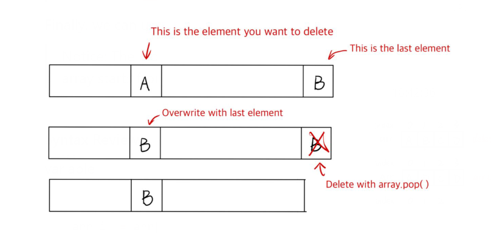

# Content/Shift

Once we enter the `if` statement, it means we have found the ***_tokenId*** to be deleted while iterating through the account wallet.

Therefore, inside the `if` statement, what we need to write now is the deletion logic for the TokenId in the wallet.

In Solidity, we can only use the `pop` statement to delete the last element of an array. However, the element we want to delete may not be the last one.

To solve this, we can swap the position of the TokenId to be deleted with the last TokenId in the *array*. Then, we can use the `pop` statement to delete the desired TokenId.

In the actual implementation, we only need to overwrite the index position of the TokenId to be deleted, with the last element of the array.

> We don't need to "move the TokenId to be deleted to the last element of the array," because the TokenId to be deleted is no longer meaningful, we can simply overwrite it.
> 

Finally, we can use the `pop` statement to delete the last element of the array.

> Notice: The index of the last element in the array is *arr.length-1* because the index of the array starts from *0*.
> 



**Syntax Review**

variable

- hint
    
    ```solidity
    arr[i] = arr[arr.length - 1];
    ```
    
