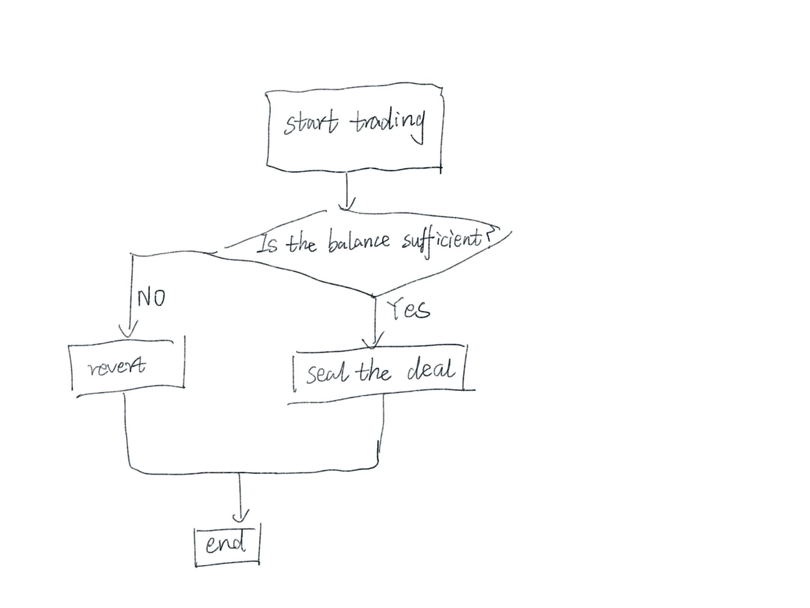

# Content/Content

### Concept

A while ago, we learned about a commonly used exception handling syntax, `require`. In this section, we will introduce another exception handling syntax - `revert`.

When an exception occurs in a Solidity *contract*, executing the `revert` statement will immediately stop the execution of the current function and undo all changes to the state.

- Metaphor
    
    Think of `revert` as a time machine in a computer program. When something goes wrong, it immediately takes you back to where everything was okay, ensuring nothing from the problematic point onwards actually happened.
    
- Real Use Case
    
    For instance, in the [ERC20](https://github.com/OpenZeppelin/openzeppelin-contracts/blob/9ef69c03d13230aeff24d91cb54c9d24c4de7c8b/contracts/token/ERC20/ERC20.sol#L205C4-L217C1) *contract*, when someone is trying to transfer more money than they actually have, we will revert the transaction, stop the execution, and undo all changes, ensuring that no funds are wrongly allocated and the user's balance remains unchanged.
    
    ```solidity
    function decreaseAllowance(address spender, uint256 requestedDecrease) public virtual returns (bool) {
            address owner = _msgSender();
            uint256 currentAllowance = allowance(owner, spender);
            if (currentAllowance < requestedDecrease) {
                revert ERC20FailedDecreaseAllowance(spender, currentAllowance, requestedDecrease);
            }
            unchecked {
                _approve(owner, spender, currentAllowance - requestedDecrease);
            }
    
            return true;
        }
    ```
    
    
    

### Documentation

Use `revert` to terminate the execution of the *function*, with optional *parameters* to return.

```solidity
function dosome() public {
	//In the above example, the execution of the `function` was terminated using `**revert()**`, where *5*, *true*, and *****address(0x123)* are the list of `parameters` that can be displayed in the error message.
  revert(5, true, address(0x123));
}
```

### FAQ

- When to use revert instead of require?
    
    Not everything can be checked with a simple boolean expression. When we need to handle complex judgment exceptions like `if-else`, we need to use `revert`
    
    ```solidity
    if(num == 1) {
      revert("[error1] : num == 1");
    }else if(num == 10){
      revert("[error2] : num == 10");
    }else if(num == 100){
      revert("[error3] : num == 100");
    }else{
      //Perform the rest
    }
    ```
    

# Example/Example

```solidity
pragma solidity 0.6.0;

contract Bank {
  mapping(address => uint256) balanceOf;

  function deposit(uint256 amount) public payable {
    //Use require to check parameters
    require(msg.value == amount, "Deposit amount must be equal to the sent value");
    uint256 oldBalance = balanceOf[msg.sender];
    balanceOf[msg.sender] += amount;
  }

  function withdraw(uint256 amount) public {
    //When using branches to determine multiple possible error situations, reverse can be used
    if (amount <= 0) {
      revert("Invalid withdrawal amount");
    } else if (balanceOf[msg.sender] < amount) {
      revert("Insufficient balance for withdrawal");
    }
    payable(msg.sender).transfer(amount);
    uint256 oldBalance = balanceOf[msg.sender];
    balanceOf[msg.sender] -= amount;
  }
}
```