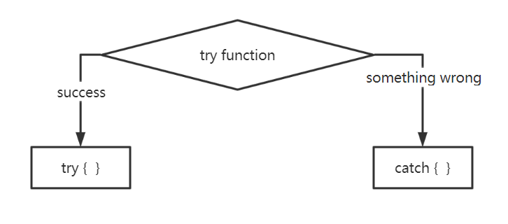
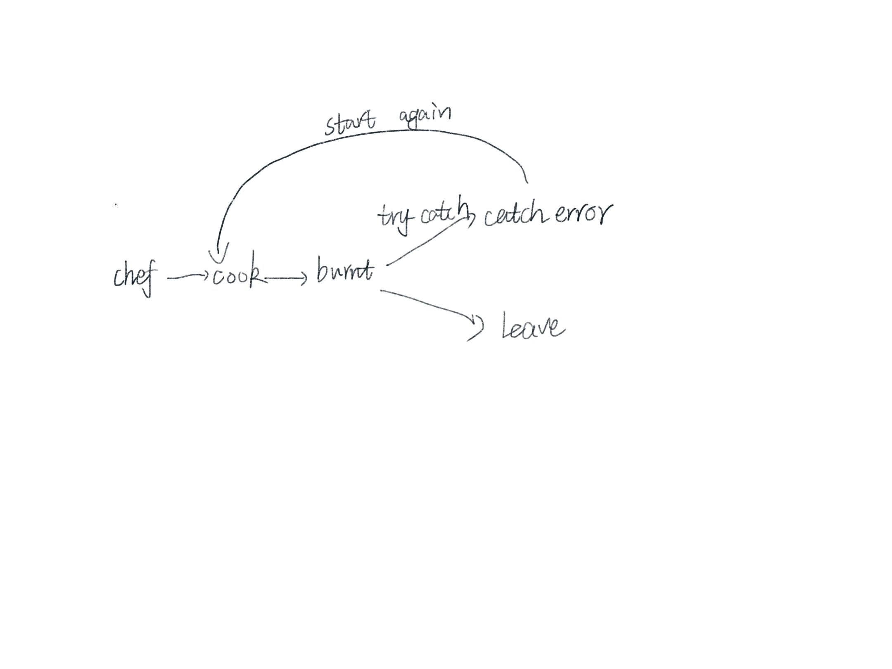

# Content/Content

### Concept

In previous lessons, we have learned about the exception handling mechanism: `revert`, `require`, and `assert`. In this section, we will learn `try-catch`.

`try-catch` handles function call failures: successful calls run the `try` block, while failed ones execute the `catch` block.



- Metaphor
    
    As a chef, you use a "try-catch" method: "try" to cook, if it burns, "catch" the error, clean up, and start again. Without it, if a dish burns, you'd just leave the kitchen.
    
    
    
- Real Use Case
    
    In OpenZepplin's ***[GovernorVotes](https://github.com/OpenZeppelin/openzeppelin-contracts/blob/9ef69c03d13230aeff24d91cb54c9d24c4de7c8b/contracts/governance/extensions/GovernorVotes.sol#L25C1-L31C6)** contract*, there is a *function **clock*** to get the time. This *function* will call `token.clock()` to get the time, but due to a possible error, the call will be rolled back.
    But in order to ensure the normal execution of governance, the `try-catch` statement is used here to catch possible exceptions, and call `SafeCast.toUint48(block.number)` when an exception occurs; the current block number is returned as time.
    
    ```solidity
    function clock() public view virtual override returns (uint48) {
        try token.clock() returns (uint48 timepoint) {
            return timepoint;
        } catch {
            return SafeCast.toUint48(block.number);
        }
    }
    ```
    

### Documentation

`try` a function without a return value.

```solidity
try recipient.send(amount) {
  //send success
} catch {
  //send failed
}
```

### FAQ

- What is the primary purpose of the try-catch mechanism in Solidity?
    
    The `try-catch` mechanism is used to handle *errors* gracefully in Solidity, especially when making external calls to other *contracts*. If the external call fails, the `catch` block can be used to handle the error, ensuring that the contract doesn't fail unpredictably.
    

# Example/Example

```solidity
pragma solidity ^0.8.0;

contract PaymentExample {
  event Success();
  event Failure();

  function sendEther(address contractB) public {
    try B(contractB).dosome() {
      emit Success();
      //send success
    } catch {
      emit Failure();
      //send failed
    }
  }
}

contract B {
  function dosome() public {
    revert();
  }
}
```
