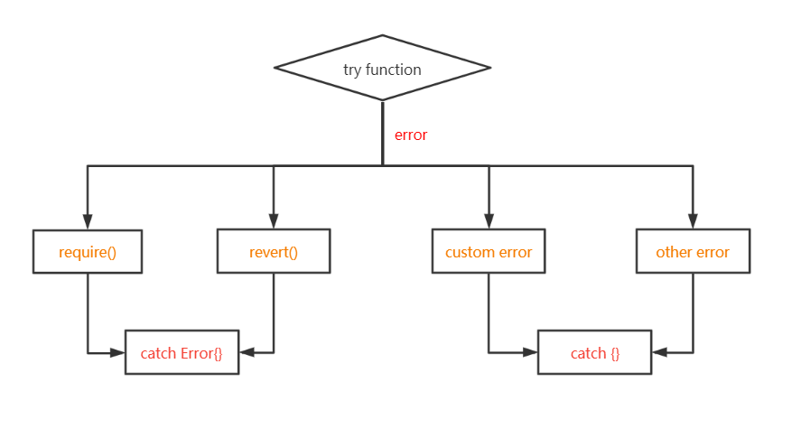

# Content/Content

### Concept

We've previously studied `try-catch`. Now, we'll learn to catch specific *errors*. `Catch` is like a mechanism that allows the program to identify *errors* after catching it. Similar to how a safety net catches a falling object, we deal with the object depending on what the object is, instead of throwing all of the objects away. 

- Metaphor
    
    The `try-catch` mechanism in programming can be likened to a conveyor belt in a factory sorting different types of fruits. In this metaphor, the conveyor belt represents your code trying to execute various operations, symbolized as different kinds of fruits. When these fruits (or code operations) are in good condition, they're like good apples that get correctly sorted. However, when a 'rotten' fruit comes along—representing an *error* or bug in the code—that's akin to a specific type of error being caught in a `catch` block. This rotten fruit is sorted into a special basket designated for bad fruits, without affecting the sorting of the good apples. This way, even if issues arise, the whole conveyor belt (or code) doesn't come to a complete stop but is able to handle each situation appropriately. Just as specialized baskets at the end of a conveyor belt allow for the sorting and handling of different kinds of fruits, the `try-catch` mechanism allows for effective handling of different types of *errors*.
    
    
    
- Real Use Case
    
    For instance, in complex scenarios like money transfers, where issues could arise from a zero address, insufficient amount, or sender's low balance, using `catch` helps to manage each issue effectively.
    
    ```solidity
    try recipient.send(amount) {
      //send success
    } catch Error(uint a) {
      if (a == 0){
        //handle the error of zero address
      }
      if (a == 1){
        //handle the error of no enoug balance
      }
    }
    ```
    

### Documentation

`catch Error(...){...}`: You can capture *errors* caused by `require` or `revert` statements in this block.

```solidity
try transfer(addr, amount) {

} catch Error(string memory err) {
  // handle errors caused by require or revert ****statement
} 

function transfer(address addr, uint amount){
  //if this require failed, catch Error above will be executed
  require(addr != address(0), "address is 0");
}
```

### FAQ

- Is it good practice to catch all exceptions?
    
    Generally, it's not recommended to *catch* all exceptions unless you have a good reason for it, like logging the error information for debugging or displaying a user-friendly error message before safely terminating the program.
    
- Can I re-throw an exception after catching it?
    
    Yes, you can re-throw an exception after *catching* it if you want it to be handled by an outer `try-catch` block or propagate it further up the call stack.
    
- How does exception handling differ between languages?
    
    While the general concept of `try-catch` is similar across languages, the specifics, like the syntax and the types of exceptions, can differ.
    

# Example/Example

```solidity
// SPDX-License-Identifier: GPL-3.0
pragma solidity ^0.8.0;

error SpecificNumerator(string msg);

contract ErrorHandlingExample {
  uint public result;

  function divide(uint numerator, uint denominator) external {
    try this.safeDivide(numerator, denominator) returns (uint quotient) {
      result = quotient;
    } catch Error(string memory /*reason*/) {
      //  handle revert() and require()
      result = 11;
    } catch (bytes memory /*lowLevelData*/) {
      // handle custome error and others
      result = 22;
    }
  }

  function safeDivide(uint numerator, uint denominator) external pure returns (uint) {
    require(denominator != 0, "Division by zero");
    if(numerator == 99 ) {
      revert("the numerator is 99");
    }

     if(numerator == 88 ) {
      revert SpecificNumerator("the numerator is 88");
    }

    assert(numerator >= denominator);

    return numerator / denominator;
  }
}
```
