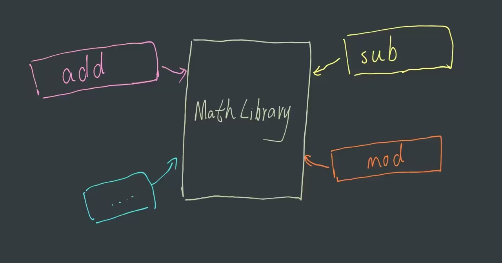

# Content/Content

### Concept

In this section, we will learn about the library, which is a special type of contract, only without state *variables*. We extract reusable code and create a library from it. 

- Metaphor
    
    Solidity's *libraries* are like a toolbox: they provide specific *functions* for tasks in *smart contracts*, keeping your code clean, just as tools are neatly stored in a toolbox.
    
- Real Use Case
    
    For example, mathematical operations like square root, multiplication, and division are often used across multiple *smart contracts.* To make our codebase more efficient and manageable, we could create a library called ***[Math](https://github.com/OpenZeppelin/openzeppelin-contracts/blob/master/contracts/utils/math/Math.sol)*** for these operations.
    
    ```solidity
    library Math {
        /**
         * @dev Throws if overflow occurs during muldiv operation.
         */
        error MathOverflowedMulDiv();
    
        enum Rounding {
            Floor, // Toward negative infinity
            Ceil, // Toward positive infinity
            Trunc, // Toward zero
            Expand // Away from zero
        }
    
        /**
         * @dev Returns the addition of two unsigned integers, 
    				with an overflow flag.
         */
        function tryAdd(uint256 a, uint256 b) internal pure returns (bool, uint256) {
            unchecked {
                uint256 c = a + b;
                if (c < a) return (false, 0);
                return (true, c);
            }
        }
    
        // Add more functions for other operations here...
    }
    
    ```
    
    In this *library*, we define an error for overflow during multiplication-division (***MathOverflowedMulDiv***) operations and an enum for various rounding options. By using this *library*, we can ensure that our mathematical operations are consistent and safe across all *contracts* that use them. Moreover, if we ever need to update or modify these shared mathematical *functions*, we only have to make the changes once in the ***Math***, making the code more maintainable and efficient.
    
    
    

### Documentation

Similar to contract, we use `library` ****keyword followed by the name to define a *library*.

For example, here is the definition of a *library* named ***StringLibrary***.

```solidity
//Defining functions and strucrs in Library is exactly the same as in contract.
library StudentLibrary {
  struct Student{
    string name;
    uint id;
    uint grade;
  }

  function compareGrades(Student S1, Student S2) returns(Student){
    //function body
  }
}
```

### FAQ

- Can I define a function that modifies state variables in a library?
    
    No, *libraries* in Solidity don't have their own state *variables*. However, they can modify the state of *contracts* that use them if those *contracts* pass their state *variable* as a parameter to the library's *functions*.
    
- Can a library function return a struct?
    
    Yes, *library* *functions* can return *structs*. When defining the *function*, you'll specify the return type as the struct that the *library* has defined. For example, `function getStudent() public view returns (Student) {}` would return a `Student` struct.
    

# Example/Example

```solidity
pragma solidity ^0.8.0;

library MathLibrary {
    function square(uint256 x) external pure returns (uint256) {
        return x * x;
    }
}
```
