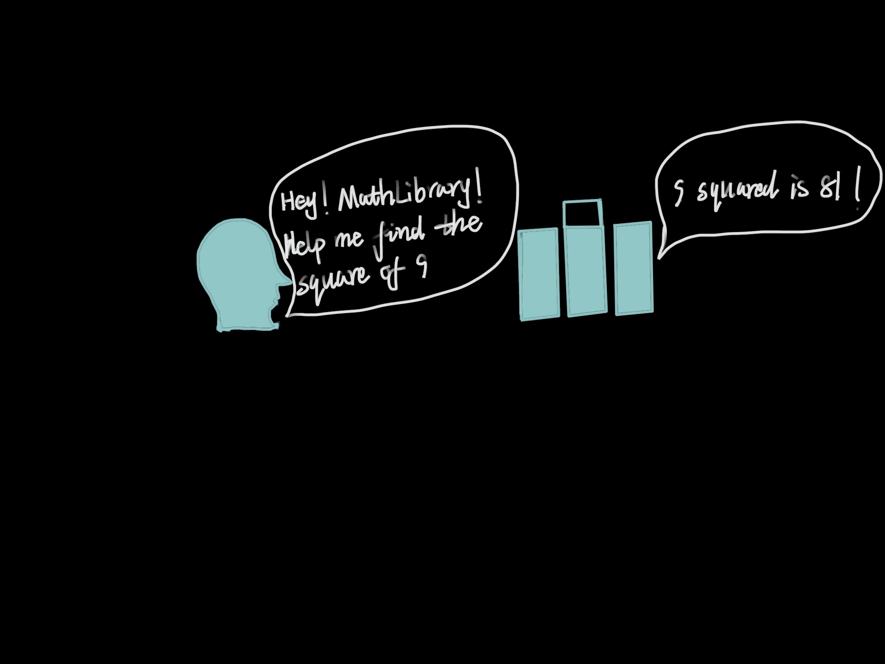

# Content/Content

### Concept

In the previous section, we learned about the definition of library. Now, we will continue to learn how to use it.

- Metaphor
    
    Earlier we said that calling a *function* is like pressing a button on a black box that will perform some action for you. A library contract is like a magic box filled with various useful *functions*. We only need to use the `libraryName + functioName` to call the *function* in the *library contract*.
    
    For example, in the last lesson, we defined a ***MathLibrary** library*, which contains some mathematical operations. Now we can call the ***square** function* in *another contract* to calculate the square of a number:
    
    ```solidity
    MathLibrary.square(y);
    ```
    
    
    
- Real Use Case
    
    In the ***[GovernorVotes](https://github.com/OpenZeppelin/openzeppelin-contracts/blob/9ef69c03d13230aeff24d91cb54c9d24c4de7c8b/contracts/governance/extensions/GovernorVotes.sol#L25C1-L31C6)*** contract of OpenZepplin, there is a *function **clock*** to obtain the time, and the ***toUint48** function* of ***SafeCast*** is called in the `catch`.
    
    ```solidity
    function clock() public view virtual override returns (uint48) {
        try token.clock() returns (uint48 timepoint) {
            return timepoint;
        } catch {
            return SafeCast.toUint48(block.number);
        }
    }
    ```
    

### Documentation

We can use the syntax `LibraryName.functionName(parameterList)`. 

```solidity
//For example, here we call the dosome function from the MathLibrary library.
MathLibrary.dosome();
```

### FAQ

- Is there any difference between libray call and contract call?
    
    There is a difference, libray is actually part of the contract, so you can call the `internal` *function* in *library call*.
    The *contract call* cannot call the `internal` *function* in it.
    
- How do we call functions from a library contract?
    
    Unlike *contracts* that require a variable for calls, libraries allow direct *function calls* by using the syntax `LibraryName.functionName(parameterList)`
    

# Example/Example

```solidity
pragma solidity ^0.8.0;

library MathLibrary {
  function square(uint256 x) external pure returns (uint256) {
    return x * x;
  }
}

contract ExampleContract {
  function calculateSquare(uint256 y) external pure returns (uint256) {
    // Calling functions in a library contract.
    uint256 result = MathLibrary.square(y);
    return result;
  }
}
```
