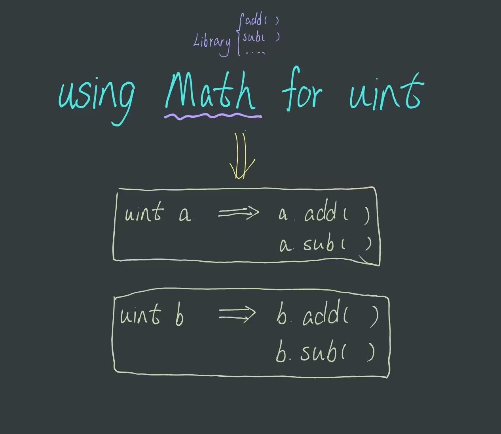

# Content/Content

### Concept

In the previous sections, we have learned about the definition and call of *libraries*. In this section, we will explore a special use case of *libraries* - attaching functions **from a library to any type.

The statement `using A for B;` ****can be used to attach all *functions* from *library **A*** to a specific type B ****in a *contract*. Once this statement is added, these *functions* will automatically become members of type B *variables **b***, and you can directly call them using `b.functionName()`.

Here ***b*** will be the first parameter of the *function*. 



- Metaphor
    
    It's as if you're sticking a magic label on type B that says "A". Once this tag is attached, type B does magic, because it automatically has all the *functions* in library ***A***.
    
- Real Use Case
    
    The *library* just mentioned is also used in Uniswap v3 and the new *contract **[UniswapV3Pool](https://github.com/Uniswap/v3-core/blob/d8b1c635c275d2a9450bd6a78f3fa2484fef73eb/contracts/UniswapV3Pool.sol#L33C1-L34C31)***.
    
    ```solidity
    using SafeCast for uint256;
    using SafeCast for int256;
    ```
    

### Documentation

The `using...for...` statement can be used to attach *functions* from a *library* to a specific *type*.

```solidity
//For example, here we attach the ***MathLibrary*** library to the uint256 type,
//allowing all variables of type uint256 to directly use the functions from the ***MathLibrary*** library.
using MathLibrary for uint256;

uint a;
//assume MathLibrary has add(uint a, uint b) function
//this is the same as add(a,b)
a.add(b);
```

### FAQ

- What is the main benefit of creating a customized math library for frequently used calculations like geometric mean in a contract？
    
    This step is mainly to make coding easier. For example, if we have a *contract* that frequently uses geometric mean, then we could have a customized math library that optimizes this calculation, and every time we could do `a.geoMean(b,c,d)` instead of `MathLibrary.geomean(a,b,c,d)`.
    
    ```solidity
    using MathLibrary for uint256;
    uint256 x.geoMean(y,z,w);
    ```
    

# Example/Example