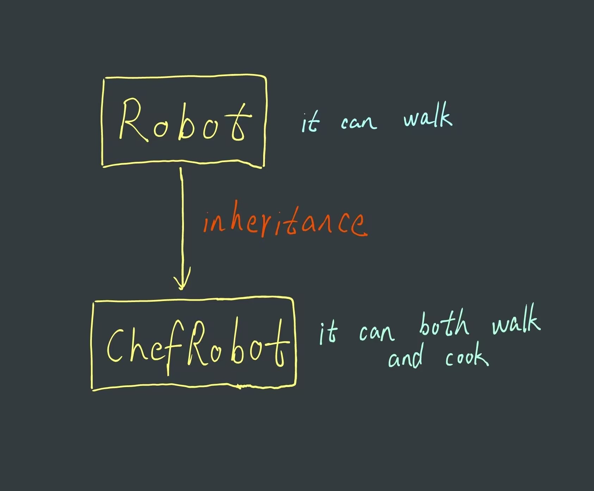

# Content/Content

### Concept

In the previous lessons, we learned how to use library, which is one way to organize and reuse code. In this section, we will learn another —— inheritance.

*Inheritance* in programming, like in real life, means gaining properties and capabilities from a 'parent'. A *child contract* inherits from a *parent contract*, meaning it can use the parent's code.

- Metaphor
    
    If you have a basic robot (parent) that can walk, and you want to create a chef robot (child) that can also cook, instead of building it from scratch, you just add the cooking ability to the basic robot.
    
    
    
    The *child contract* (***ChefRobot***) can now both walk and cook because it inherited the walking *function* from the *parent contract* (***Robot***), and we added the cooking *function* specifically to it.
    
    ```solidity
    // Parent contract: a basic robot that can walk
    contract Robot {
      function walk() public pure returns (string memory) {
        return "I can walk!";
      }
    }
    
    // Child contract: a chef robot that inherits walking ability from the basic robot, and can also cook
    contract ChefRobot is Robot {
      function cook() public pure returns (string memory) {
        return "I can cook!";
      }
    }
    ```
    
- Real Use Case
    
    The ***[UniswapV3Pool](https://github.com/Uniswap/v3-core/blob/d8b1c635c275d2a9450bd6a78f3fa2484fef73eb/contracts/UniswapV3Pool.sol#L30C1-L30C59)*** *contract* mentioned in the previous section also *inherits* a *contract* ***NoDelegateCall***.
    
    ```solidity
    contract UniswapV3Pool is IUniswapV3Pool, NoDelegateCall {
    ```
    
    It also inherits an interface which we will talk about in a few units. 
    

### Documentation

Using the `is` keyword, you can inherit any *contract*.

```solidity
//For example, here we define a contract called ChildContract and inherit the ParentContract contract.
contract ChildContract is ParentContract { }
```

### FAQ

- What is contract inheritance in Solidity and how does it work?
    
    Contract inheritance in Solidity allows a *contract* to *inherit* properties and behaviors from another *contract*. This includes *state variables*, *functions*, *modifiers*, and *events*, enabling more modular and reusable code.
    

# Example/Example

```solidity
pragma solidity ^0.8.0;

contract ParentContract {
  // State variables and functions in the parent contract.
   uint public parentVariable = 1;

  function parentFunction() public pure returns (string memory) {
    return "Hello from parent contract!";
  }
}

contract ChildContract is ParentContract {
  // State variables and functions in the child contract.
  uint public childVariable;

  function childFunctionCallParentFunction() public pure returns (string memory) {
    return parentFunction();
  }

  function childFunctionUsingParentVariable() public {
    childVariable = parentVariable;
  }
}
```