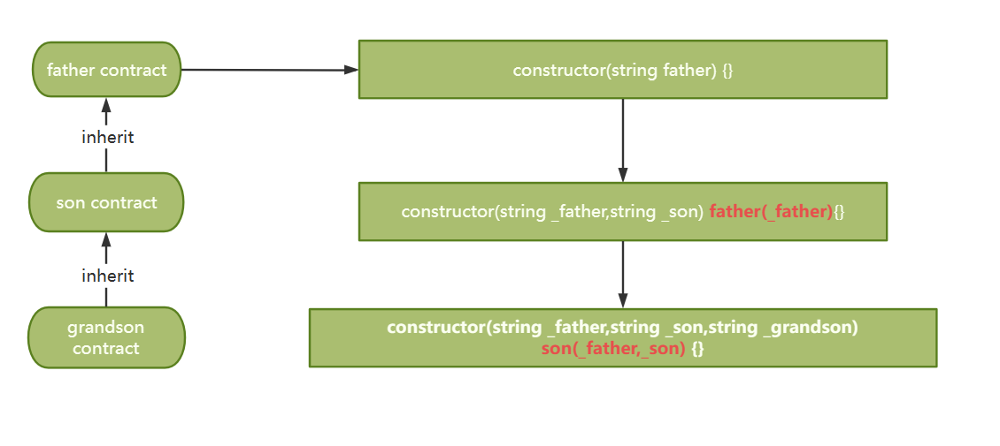

# Content/Content

### Concept

In the previous section, we learned how to *inherit contracts*. In this section, we will learn how to correctly initialize the constructor of the *inherited contract*, and add more *constructor* logic when *inheriting*.



- Metaphor
    
    Imagine you are building a multi-story house. Each story (or level) of the house is based on the design of a previous generation of architects in your family.
    
    1. **Foundation (Base Constructor)**:
        
        Your grandfather was the first architect. He designed the foundation of the house. No matter how many additional floors or features you add, you always begin with this foundation. In Solidity, this foundation is like the base *contract's* constructor. 
        
    2. **First Story (First Inherited Constructor)**:
        
        Your father then designed the first floor based on the foundation laid by your grandfather. He added rooms, doors, and windows. In Solidity, this is like a *contract* that *inherits* from the *base contract*. When constructing this floor, it's essential to ensure that the foundation is acknowledged, and then the specific features of the first floor are added.
        
    3. **Second Story (Second Inherited Constructor)**:
        
        You, also an architect, decided to build a second floor based on the design of the first floor. You had to ensure that the foundation was strong, and the first floor was stable, and then you could add the design for the second floor. In Solidity, this is like a *contract inheriting* from the first *inherited contract*. The constructor of this *contract* needs to ensure that the base *contract* and the first inherited *contract's constructors* are called and executed before adding their own specific features.
        
- Real Use Case
    
    The following code is given in the official OpenZepplin documentation, where `ERC20("MyToken", "MTK")` inherits the constructor in [ERC20](https://github.com/OpenZeppelin/openzeppelin-contracts/blob/9ef69c03d13230aeff24d91cb54c9d24c4de7c8b/contracts/token/ERC20/ERC20.sol#L59C1-L62C6), so it needs to be initialized by passing parameters here.
    
    ```solidity
    contract MyToken is ERC20, ERC20Burnable, Ownable {
        constructor() ERC20("MyToken", "MTK") {}
        ...
    }
    ```
    

### Documentation

To initialize the *inherited contract's* constructor correctly, use its name followed by the *constructor* arguments within parentheses after the *constructor parameters*.

```solidity
//For example, here we inherit from ERC20 and initialize 
//the constructor of ERC20 within our own constructor.
constructor(string name, string symbol) ERC20(name, symbol) { }
```

### FAQ

- Why do we need to initialize the constructor of the inherited contract?
    
    In Solidity, when *contract* **A** inherits from *contract ***B**, the code of **B** is copied into **A**. To ensure proper initialization, **A** calls the *constructor* of **B** within its own *constructor* before executing its own constructing steps. It’s like you installed Steam on your Mac. To initialize your Mac properly, you also need to initialize your Steam.
    

# Example/Example

```solidity
pragma solidity ^0.8.0;

// contract B
contract B {
  uint public bValue;

  constructor(uint _value) {
    bValue = _value;
  }
}

// contract A inherit contract B
contract A is B {
  uint public aValue;

  constructor(uint _valueA, uint _valueB) B(_valueB) {
    aValue = _valueA;
  }
}
```
