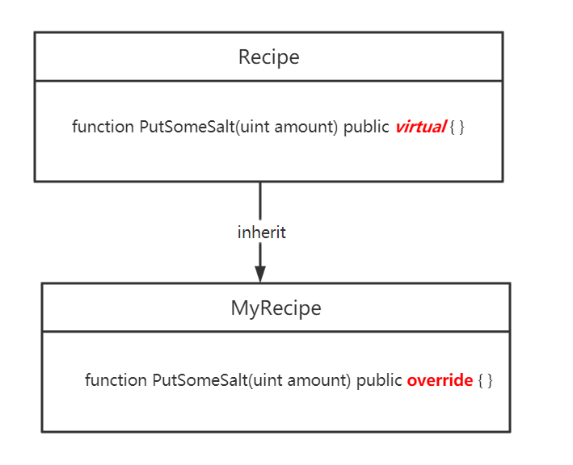

# Content/Content

### Concept

In the previous section, we learned about function overriding in *inheritance* using the `override` keyword. In this section, we will explore the `virtual` ****keyword.

To *override* a *function* in the *child contract*, we need to mark the *function* as `virtual` in the *parent contract* to grant *overriding* permission. 



- Metaphor
    
    Think of *inheritance* and `virtual` like a family tree. Imagine you are the child in a family and *inherit* traits from your parents, like eye color or height. But some traits can be "*overridden*," like the way you dress or your career choice. The `virtual` keyword allows for such an *override*, letting you establish your individuality while still being part of the family tree.
    
- Real Use Case
    
    In the *parent contract* [ERC20](https://github.com/OpenZeppelin/openzeppelin-contracts/blob/fd81a96f01cc42ef1c9a5399364968d0e07e9e90/contracts/token/ERC20/ERC20.sol#L348), you need to define ***_beforeTokenTransfer*** as `virtual`.
    
    ```solidity
    function _beforeTokenTransfer(address from, address to, uint256 amount) internal virtual {}
    ```
    

### Documentation

Using the `virtual` keyword in the *function* definition allows the *function* to be *overridden* by *child contracts*.

```solidity
//For example, here we define a **virtual** function ***getArea*** 
//which allows child contracts to override it and implement their specific functionality.
function getArea() public virtual returns (uint) { }
```

### FAQ

- What kind of functions need to use the virtual keyword?
    
    It should be noted that not all *functions* need to use the `virtual` keyword. Only those *functions* that may need to be modified or customized in *subcontracts* need to be marked as `virtual`. For those functions that need to maintain consistency, the `virtual` keyword should be omitted to ensure that its implementation in the *inherited contract* remains consistent.
    

# Example/Example

```solidity
pragma solidity ^0.8.0;

contract Shape {
  uint public sides;

  constructor() {
    sides = 0;
  }

  // Define the function to calculate the area as virtual, allowing it to be inherited.
  // The child contract can override it as needed.
  function getArea() public virtual returns (uint) {
    return 0;
  }
}

contract Square is Shape {
  uint private sideLength;

  constructor(uint _sideLength) {
    sideLength = _sideLength;
    sides = 4;
  }

  // The formula to calculate the area of a square is side * side.
  function getArea() public virtual override returns (uint) {
    return sideLength * sideLength;
  }
}

contract Triangle is Shape {
  uint private base;
  uint private height;

  constructor(uint _base, uint _height) {
    base = _base;
    height = _height;
    sides = 3;
  }

  // The formula to calculate the area of a triangle is (base * height) / 2.
  function getArea() public virtual override returns (uint) {
    return (base * height) / 2;
  }
}
```
