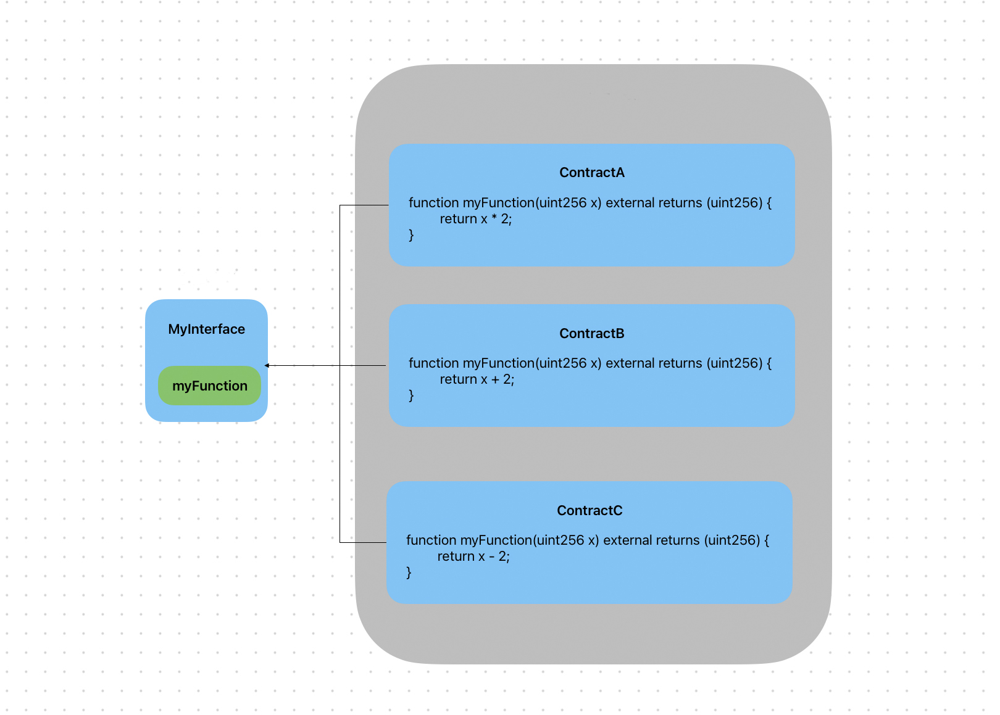

# Content/Content

### Concept

Starting from this section, we will enter the study of interface. First, we will learn about the definition of an *interface*. An *interface* is similar to a *contract*, but it only specifies required functionalities and behaviors without implementation details. It includes function headers with **names, parameter types,** and **return types**, but no *function bodies*.

- Metaphor
    
    *Interfaces* are like electrical outlets in your home. Regardless of the brand or model of electrical appliances, as long as they meet the standards of the electrical outlet, they can be plugged into the outlet and receive a power supply. The power socket defines the *interface* specifications that electrical appliances should follow, thus realizing the interoperability between different electrical appliances and sockets. Likewise, the interface plays a similar role in Solidity, ensuring compatibility and interoperability between contracts by defining standardized function signatures and behaviors.
    
    
    
- Real Use Case
    
    The ERC20 interface [IERC20](https://github.com/OpenZeppelin/openzeppelin-contracts/blob/9ef69c03d13230aeff24d91cb54c9d24c4de7c8b/contracts/token/ERC20/IERC20.sol#L9C1-L79C2) in OpenZepplin is implemented as follows:
    
    ```solidity
    interface IERC20 {
        ...
        function transferFrom(address from, address to, uint256 amount) external returns (bool);
    }
    ```
    

### Documentation

We use the `interface` keyword to define an interface.

```solidity
//define an interface named MyInterface ******with an interface function myFunction.
interface MyInterface {
  function myFunction(uint256 x) external returns (uint256);
}
```

<aside>
💡 The *visibility* of *functions* defined in the interface must be `external`.

</aside>

### FAQ

- Why define interfaces?
    
    *Interfaces* are blueprints for *contracts*, allowing other *contracts* or developers to interact without worrying about implementation details.
    
- Could we define variables in interfaces?
    
    No, they cannot. In Solidity, *interfaces* are primarily used to define the function signatures of contracts, ensuring that contracts adhere to specific interface standards. 
    
    Therefore, *interfaces* can only define *function signatures*, including **function names, parameter lists,** and **return types**; they cannot define *variables*. If you need to define *variables* within a *contract*, you should use *contracts* themselves, not *interfaces*.
    

# Example/Example

```solidity
// Define interface
interface MyInterface {
  //Functions in interfaces must be defined as external,since the purpose of interfaces is to be used by external calls.
  // In function interfaces, parameter names can be omitted, and the syntax myFunction(uint256) is also valid.
  function myFunction(uint256 x) external returns (uint256);
}

// Implementing contract for the interface
contract MyContract {
  function myFunction(uint256 x) external returns (uint256) {
    // Implemention of function
    return x * 2;
  }
}

// Contract using the interface to call functions
contract CallerContract {
  MyInterface public myContract;

  // Pass the address of MyContract
  constructor(address contractAddress) {
    myContract = MyInterface(contractAddress);
  }
  // Call myFunction in MyContract through the interface (we will discuss interface calls in detail in the next section)
  function callInterface(uint256 value) public returns (uint256) {
    uint256 result = myContract.myFunction(value);
    return result;
  }
}
```
