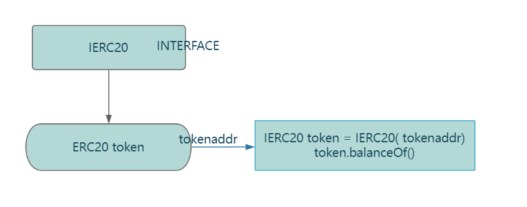

# Content/Content

### Concept

In this section, let's explore how *interfaces* enable interaction with external contracts.

Once an *interface* is defined, we can use `InterfaceName(address).functionName()` syntax to interact with other *contracts*.



- Metaphor
    
    Think of a Solidity interface as the menu at a restaurant. The menu tells you the names of the dishes you can order and might even describe what goes into them, but it won't tell you how those dishes are prepared—that's the kitchen staff's job (i.e., the *contract* that implements the *interface*). When a customer (another *contract*) wants to order something, they look at the menu (*interface*), but it's the kitchen staff (the *contract* implementing the *interface*) that actually prepares and delivers the dish (executes the *function*).
    
- Real Use Case
    
    In the implementation of ***[ERC20Wrapper](https://github.com/OpenZeppelin/openzeppelin-contracts/blob/9ef69c03d13230aeff24d91cb54c9d24c4de7c8b/contracts/token/ERC20/extensions/ERC20Wrapper.sol#L16C1-L86C2)***, ***_underlying*** is defined as an interface variable, and the ***balanceOf** function* can be called randomly using `interface.functionName()`.
    
    ```solidity
    abstract contract ERC20Wrapper is ERC20 {
        IERC20 private immutable _underlying;
    
        function _recover(address account) internal virtual returns (uint256) {
            uint256 value = _underlying.balanceOf(address(this)) - totalSupply();
            _mint(account, value);
            return value;
        }
    }
    ```
    

### Documentation

To interact with *interfaces*, we need three pieces of information:

1. The name/definition of the *interface*.
2. The address of the *contract* implementing the *interface*.
3. The *function* we want to call.

We can use the syntax `InterfaceName(address).functionName()` to call *functions* of other *contracts*.

```solidity
//define an interface variable called c. 
IContract c = IContract(contractAddr);
//use c.getValue() to call the getValue ******functions of the contract at address contractAddr.
c.getValue();
```

### FAQ

- Why do we need interfaces for contract interaction?
    
    *Interfaces* are helpful when we know the address of the *contract* we want to interact with and the *function* we want to call, but we are unaware of the *contract's* specific implementation.
    

# Example/Example

```solidity
// Define the interface
interface OtherContractInterface {
  function getValue() external view returns (uint256);
  function setValue(uint256 newValue) external;
}

// Contract A
contract ContractA {
  uint256 public value;

  function setValue(uint256 newValue) public {
    value = newValue;
  }
  // Pass the address of contract B, then use the interface to call contract B's function
  function callGetValue(address contractBAddress) public view returns (uint256) {
    ContractB contractB = ContractB(contractBAddress);
    return contractB.getOtherContractValue();
  }
}

// Contract B
contract ContractB {
  // Variable of interface type, similar to contract variables
  OtherContractInterface public otherContract;

  // Assign the value in the constructor
  constructor(address otherContractAddress) {
    otherContract = OtherContractInterface(otherContractAddress);
  }
  // Use the interface to call the setValue function
  function callSetValue(uint256 newValue) public {
    otherContract.setValue(newValue);
  }

  function getOtherContractValue() public view returns (uint256) {
    return 5;
  }
}
```
