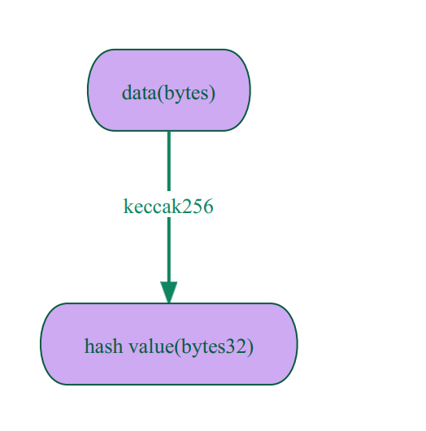

# Content/Content

### Concept

In this section, we will learn about **hash calculations** in Solidity. Hash calculation turns **variable-length** data into **fixed-length** values, with distinct `bytes` nearly always hashing to unique results. 

Another thing, it’s easy to calculate the hash of any input, but given a hash, it’s almost impossible to find the input that gets this hash.

```solidity
"hello world!!!" -> ds1b
"hello world!!" -> tgf4
"12354" -> sycj
```

<aside>
💡 This is crucial for creating **unique identifiers** and **encryption signatures**.

</aside>



- Metaphor
    
    Imagine you have a blender that represents a hash function. You can put various ingredients like fruits, milk, and sugar into the blender. Once you blend these ingredients, you get a smoothie. Just like in hashing, it's easy to go from the ingredients to the smoothie, but practically impossible to get the exact original ingredients back from the smoothie.
    
- Real Use Case
    
    In [EIP712](https://github.com/OpenZeppelin/openzeppelin-contracts/blob/9ef69c03d13230aeff24d91cb54c9d24c4de7c8b/contracts/utils/cryptography/EIP712.sol#L88C1-L91C1), ***keccak256*** is used to calculate a domain-specific hash
    
    ```solidity
    function _buildDomainSeparator() private view returns (bytes32) {
        return keccak256(abi.encode(_TYPE_HASH, _hashedName, _hashedVersion, block.chainid, address(this)));
    }
    ```
    

### Documentation

***Keccak256*** is a global function that can be used directly for **hash calculations**.

- Input: It only accepts inputs of type `bytes`.
- Output: It produces `bytes32`.

```solidity
//convert the string "HackQuest" into a byte array
//then use Keccak256 ******to calculate the has, 
//and assign the result of the hash operation to the variable *res*.
bytes32 res = keccak256(bytes("HackQuest"));
```

### FAQ

- How do hash algorithms in block headers contribute to the security of a blockchain?
    
    For example, hash algorithms in **block headers** ensure blockchain security. The hash acts as a unique identifier for each block, summarizing its data. Changes to the data produce different hashes. Including the previous block's hash creates a secure chain of blocks.
    
- What Hashing Algorithms Are Available in Solidity?
    
    In Solidity, the most commonly used hashing algorithm is ***Keccak256***, which is an Ethereum-specific cryptographic hash function based on the Keccak family of hashing algorithms. You can also use ***sha256*** and ***ripemd160*** for other types of hashing. These *functions* are available as **built-in functions and can be invoked in your *smart contracts*.
    

# Example/Example

```solidity
pragma solidity ^0.8.0;

contract KeccakExample {
    // Receives a string parameter _message and returns a 32-byte hash value (of type bytes32).
    // Inside the function, we use the keccak256 function to perform a hash operation on the input string, and return the result.
    function hash(string memory _message) public pure returns (bytes32) {
        return keccak256(bytes(_message));
    }
}
```
