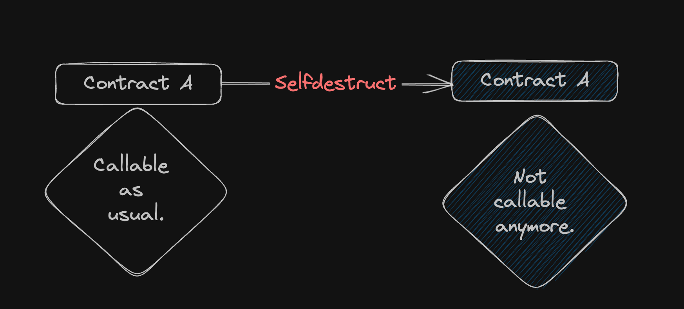

# Content/Content

### Concept

Selfdestruct is a built-in *function*(functions that you can call without defining it explicitly) that halts a *contract*, transfers any leftover Ether to an *address*, and disables the *contract* for future interaction. 

<aside>
💡 If *contract* **A** lacks a receiver and fallback, it cannot receive Ether by default. Yet, we can create *contract* **B** and forcefully transfer its Ether to **A** using **B**'s selfdestruct function.

</aside>

- Metaphor
    
    The selfdestruct function is akin to disabling a malfunctioning vending machine, preventing further input and extracting any money inside.
    
- Real Use Case
    
    The selfdestruct function is exceptionally unique as it has the capability to terminate a contract. Upon thorough examination of OpenZeppelin's codebase, we found that not a single *contract* employs this syntax. 
    
    Due to the inherent security risks associated with selfdestruct, we strongly advise against providing any interface in contracts that utilize it. If its use is deemed absolutely necessary, it is imperative to meticulously consider the associated security implications.
    
    The open-source project ***saucepoint*** offers a **[reference](https://github.com/saucepoint/sylphrena/blob/fa511e4d8163902c5fd60af58f72ead54c797863/src/Spren.sol#L12)**:
    
    ```solidity
    // SPDX-License-Identifier: UNLICENSED
    pragma solidity ^0.8.13;
    
    contract Spren {
        address immutable stormFather;
    
        constructor(address _stormFather) {
            stormFather = _stormFather;
        }
    
        function unbond(address oathBreaker) external {
            require(msg.sender == stormFather, "only stormfather can unbond");
            selfdestruct(payable(oathBreaker));
        }
    }
    ```
    

### Documentation

```solidity
function anyoneCanDestroy () public {
  //receiver needs to be address payable
  selfdestruct(receiver);
}
```

Normally we put the selfdestruct ****function ****inside a *function*, with one *parameter* specifying the receiver of remaining Ether in this *contract*. 

### FAQ

- When will the destruct be executed?
    
    For example, when your code has an important bug, like selling an NFT without actually transferring the NFT after receiving Ether, you may want to destroy the *contract* so no one interacts with it in the future. 
    
    
    

# Example/Example

```solidity
// SPDX-License-Identifier: MIT
pragma solidity ^0.8.6;

contract SimpleContract {
  address payable public owner;

  constructor() payable {
    owner = payable(msg.sender);
  }

  function onlyOwnerCanDestroy() public {
    require(msg.sender == owner, "Only the contract owner can destroy the contract");
    selfdestruct(owner);
  }
}
```