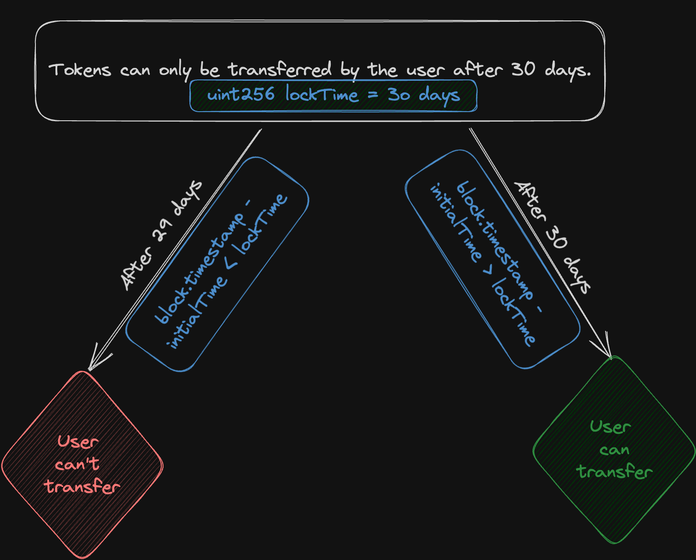

# Content/Content

### Concept

Time ****units in Solidity are predefined measurements for handling time durations in *smart contracts*, enabling accurate calculations and scheduling of events.

Essentially, they are represented in seconds and stored as uint256 data types.



- Metaphor
    
    In Solidity, time units are akin to various gauges on a time-travel dashboard, each displaying a specific measurement of time like *hours*, *minutes*, and *seconds*, allowing precise control over the temporal aspects of *smart contract* execution.
    
- Real Use Case
    
    In OpenZeppelin's ***AccessControlDefaultAdminRules*** contract, a default duration of *5 days* is employed for the ***delay***, enhancing readability and mitigating potential calculation errors.
    
    ```solidity
    function defaultAdminDelayIncreaseWait() public view virtual returns (uint48) {
        return 5 days;
    }
    ```
    

### Documentation

```solidity
uint256 second = 1 seconds; //1
uint256 minute = 1 minutes; //60
uint256 hour= 1 hours; //60 * 60 = 3600
uint256 day= 1 days; //24 * 60 * 60 = 86400
uint256 week= 1 weeks; //7 * 24 * 60 * 60 = 604800
```

Generally, we use the *uint256* data type to represent timestamps. There are five units to represent dates: seconds, minutes, hours, days, and weeks.

It's common to combine a numerical value with a time ****unit to represent a specific time interval.

### FAQ

- Why do we need variables for time units?
    
    For example, if we want to lock a token for 30 days, instead of using the expression `lockTime = 30 * 24 * 60 * 60`, we can use `lockTime = 30 days`.
    

# Example/Example

```solidity
// SPDX-License-Identifier: MIT
pragma solidity ^0.8.0;

contract TokenLock {
  uint256 public releaseTime;
  uint256 public lockDuration;

  constructor() {
    lockDuration = 30 days;
    releaseTime = block.timestamp + lockDuration;
  }

  function isLocked() public view returns (bool) {
    //if current block timestamp < releaseTime, it is locked, return true.
    return block.timestamp < releaseTime;
  }
}
```