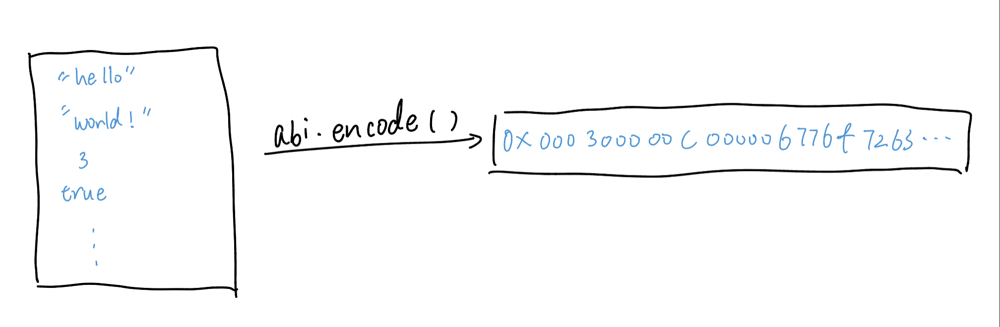

# Content/Content

### Concept

Starting from this chapter, we will learn about a special *global variable* in Solidity: **ABI** (Application Binary Interface). Technically, **ABI** is a set of built-in functions instead of variables. 

abi.encode function turns a list of parameters into a *bytes array*.  



- Metaphor
    
    Using abi.encode in Solidity is like packaging different types of ingredients into a single, organized box before sending them off to a recipe, ensuring that each ingredient is properly prepared and labeled for the cooking process.
    
- Real Use Case
    
    In [EIP712](https://github.com/OpenZeppelin/openzeppelin-contracts/blob/9ef69c03d13230aeff24d91cb54c9d24c4de7c8b/contracts/utils/cryptography/EIP712.sol#L88), the abi.encode function is utilized to encode various pieces of information from the contract, which is subsequently subjected to a hashing operation.
    
    ```solidity
    function _buildDomainSeparator() private view returns (bytes32) {
        return keccak256(abi.encode(_TYPE_HASH, _hashedName, _hashedVersion, block.chainid, address(this)));
    }
    ```
    

### Documentation

```solidity
//encodedData: the encoded results of two parameters
bytes memory encodedData = abi.encode(param1, param2);
```

We use `abi.encode()` to encode data.

<aside>
💡 abi.encode is a unique encoding, which means that given any bytes encoded with abi.encode, there is a unique set of parameters encoded.

</aside>

### FAQ

- When to use abi.encode?
    
    abi.encode might be helpful when storing data. It converts different pieces of data in different types into a uniform bytes array then store and move it conveniently in blockchain.  
    
- What is ABI?
    
    **ABI** is more than just encoding and decoding functions. It's a specification for how to interact with contracts, including the function signatures, how to encode/decode data, and the structure of events.
    

# Example/Example

```solidity
pragma solidity ^0.8.0;

contract AbiEncodeExample {
  function encodeParameters(uint256 param1, string memory param2) public pure returns (bytes memory) {
    bytes memory encodedData = abi.encode(param1, param2);
    return encodedData;
  }
}
```