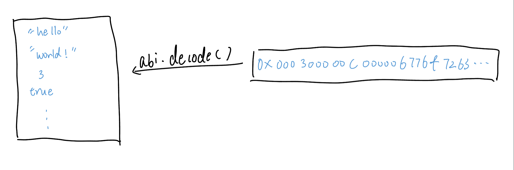

# Content/Content

### Concept

The abi.decode function in Solidity allows you to unpack and interpret raw encoded data, such as the results of function calls or the input data of transactions, converting it back into readable data structures.



- Metaphor
    
    The abi.decode function in Solidity is like a translator that takes a cryptic message (encoded data) and translates it into a clear and comprehensible message (decoded data) that you can easily understand and work with.
    
- Real Use Case
    
    The ***_setup*** function in the [ERC20CrossChain](https://github.com/axelarnetwork/axelar-examples/blob/a1f425979993221efab2dd941ba6409aabed72ce/examples/evm/cross-chain-token/ERC20CrossChain.sol#L30) contract ****decodes and extracts two string parameters (***name*** and ***symbol***) from the provided encoded params data, and uses them to initialize the contract's ***name*** and ***symbol*** properties, but only if the ***name*** property hasn't been initialized before.
    
    ```solidity
    function _setup(bytes calldata params) internal override {
            (string memory name_, string memory symbol_) = abi.decode(params, (string, string));
            if (bytes(name).length != 0) revert AlreadyInitialized();
            name = name_;
            symbol = symbol_;
        }
    ```
    

### Documentation

```solidity
//The first parameter is the byte array containing the **encoded data**, and the second parameter is the **data type** after decoding.
address decodedAddress = abi.decode(encodedData, (address));

//Here, the encoded data, ***encodedData***, is decoded into a uint256 type, an address type, and a string type.
(uint256 decodedUint, address decodedAddress, string memory decodedString) = abi.decode(encodedData, (uint256, address, string));
```

The abi.decode function is used to decode encoded data. 

abi.decode allows for decoding multiple types of parameters simultaneously.

### FAQ

- What is the difference between abi.decode and abi.encode?
    - abi.decode**:** It's used to decode encoded data, converting it back into its original data structure.
    - `abi.encode`**:** It's used to encode data into a format that can be stored or transmitted, often for passing data to a smart contract function or for event logs.

# Example/Example

```solidity
pragma solidity ^0.8.0;

contract DecodeExample {
  function decodeAddress(bytes memory encodedData) public pure returns (address) {
    // Decode encoded data to address type
    address decodedAddress = abi.decode(encodedData, (address));

    // Return the decoding result
    return decodedAddress;
  }
}
```