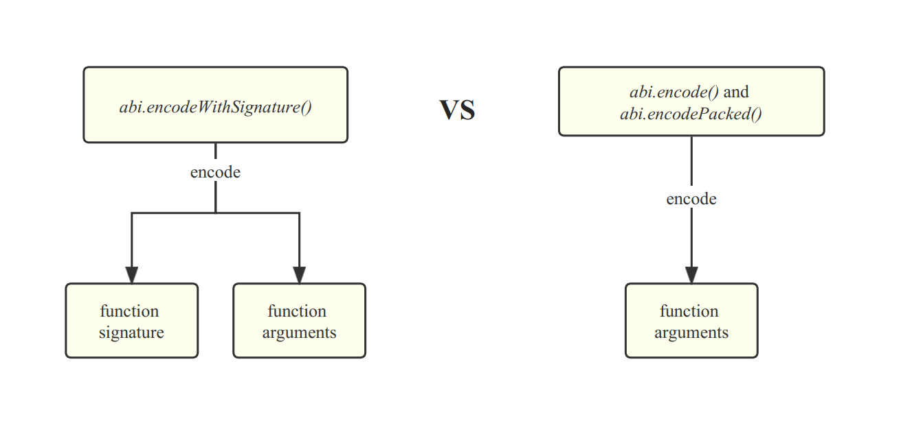

# Content/Content

### Concept

The `abi.encodeWithSignature` *function* in Solidity is used to encode *function calls* with their specific parameter types and generate the function's unique four-byte selector, which is required to interact with the Ethereum contract's functions through its ABI (Application Binary Interface).

- Metaphor
    
    Using `abi.encodeWithSignature` is akin to preparing a unique puzzle piece with a specific pattern, allowing you to send it to a friend who can effortlessly connect it with their puzzle, ensuring that the pieces match perfectly and convey a clear message.
    
- Real Use Case
    
    In SelfiePool contract, we see that [`abi.encodeWithSigature`](https://github.com/OpenZeppelin/damn-vulnerable-defi/blob/6797353c7cb5409e3d388e9e8f13954f9bb5f609/contracts/selfie/SelfiePool.sol#L35) is used to make low level calls. 
    
    ```solidity
    (bool success,) = msg.sender.call(
        abi.encodeWithSignature(
            "receiveTokens(address,uint256)",
            address(token),
            borrowAmount
        )
    );
    ```
    

### Documentation

```solidity
abi.encodeWithSignature("myFunction(uint256,string)", 123, "Hello");
```

You can directly call the `abi.encodeWithSignature()` within a *function* to encode data. It requires two parameters:

1. *function signature* 
2. The specific *arguments* of the *function*.

### FAQ

- What are the use cases?
    
    Again, this is used in **low-level call** and it will all be clear in the **low-level call** lesson. 
    
    ```solidity
    return abi.encodeWithSignature("withdraw(uint256)", amount);
    ```
    
- abi.encodeWithSignature VS abi.encode and abi.encodePacked
    
    
    
    <aside>
    💡 `encode` ****and `encodePacked` are primarily used for **data storage** and **hashing**, while `encodeWithSignature` is used for **low-level** **call**.
    
    </aside>
    

# Example/Example

```solidity
// SPDX-License-Identifier: GPL-3.0
pragma solidity ^0.8.0;

contract SignatureExample {
  function dosome(uint256 number, string memory message) public pure {
    // ...
  }

  function getEncodedSignature() public pure returns (bytes memory) {
    // Encode the function signature and arguments of "dosome" using abi.encodeWithSignature()
    bytes memory encodedData = abi.encodeWithSignature("dosome(uint256,string)", 123, "Hello");

    // Return the encoded result as the function's return value
    return encodedData;
  }
}
```