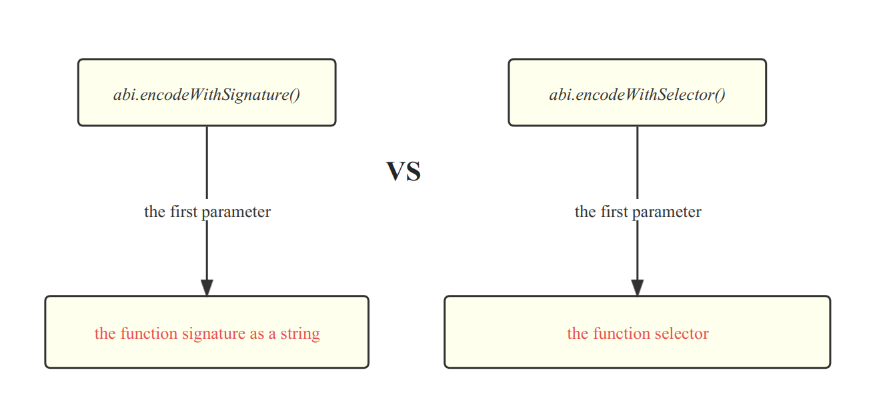

# Content/Content

### Concept

The `abi.encodeWithSelector` function in Solidity is used to encode function calls with their unique four-byte selector, which represents the function's name and parameter types, enabling interaction with the Ethereum contract's functions using their designated ABI signature.

- Metaphor
    
    Using *abi.encodeWithSelector* is like creating a signature stamp that not only represents your identity (function) but also includes the exact pattern of your handwriting, allowing you to authorize and execute specific actions (function calls) with precision and authenticity within the context of smart contracts.
    
- Real Use Case
    
    In [***FactoryProxy***](https://github.com/OpenZeppelin/workshops/blob/3c4fe56ca1b3894f384d7908cd546c3e4c5781bf/02-contracts-clone/contracts/1-ERC20/FactoryProxy.sol#L18) contract, we see that abi.encodeWithSelector is used to initialize a new contract ***UpgradeableProxy***
    
    ```solidity
    UpgradeableProxy proxy = new UpgradeableProxy(
        tokenImplementation,
        abi.encodeWithSelector(ERC20PresetFixedSupplyUpgradeable(0).initialize.selector, name, symbol, initialSupply, msg.sender)
    );
    ```
    

### Documentation

You can directly call the `abi.encodeWithSelector()` within a *function* *selector* to encode data. It requires two parameters:

1. *function selector* 
2. The specific *arguments* of the *function*.

```solidity
abi.encodeWithSelector(bytes4(keccak256("myFunction(uint256,string)")),123, "Hello");
```

### FAQ

- What is the difference between abi.encodeWithSelector() and abi.encodeWithSignaturse()?
    
    The main difference lies in the first *parameter*.
    
    - `abi.encodeWithSelector()`**:** requires manually providing the function selector as the first *parameter*. The *selector* is computed from the *function* name and *parameter* types.
    - `abi.encodeWithSignature()`**:** only requires providing the function signature as a *string* form as the first *parameter*, without the need to manually provide the selector.
        
        
        
    

# Example/Example

```solidity
pragma solidity ^0.8.0;

contract EncodeWithSelectorExample {
  function getEncodedData() public pure returns (bytes memory) {
    // Use functionName.selector to obtain the function selector
    bytes4 selector = myFunction.selector;

    // Use abi.encodeWithSelector() to encode function call data
    bytes memory encodedData = abi.encodeWithSelector(selector, 123, "Hello");

    // Return the encoded result as the return value of the function
    return encodedData;
  }

  function myFunction(uint256 amount, string memory message) public pure {

  }
}
```