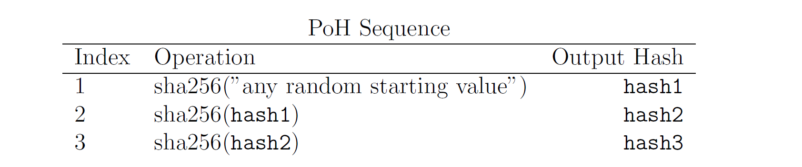

# Content/ 引文

上节我们对 Solana 链有了初步了解，本节我们继续学习 Solana 的共识机制。

正如比特币创世区块中，中本聪留下了当天《泰晤士报》的头版头条文章——The Times 03/Jan/2009 Chancellor on brink of second bailout for banks。这证明了创世区块是在 2009 年 1月 3 日当天或者之后被矿工 mint。后续所有的比特币交易，也发生在这个时间节点之后。

那么，如果后续所有的交易（或者说事件），都是顺序的，并且加盖了 “时间戳” 的，事实上这就是一个基于时间的历史事件序列。我们要证明某个交易事件在这个序列中，只要从这个历史序列中去求证即可。

和许多加密应用使用的基础技术一样，这里也将使用 hash 函数将这个序列串联起来。

### Hash函数

Solana 的 POH 共识机制中使用的哈希函数是 SHA-256，这是一种安全哈希算法，它将任意长度的输入（也称为消息）转换为一个固定长度的输出。它的作用主要是为了确保网络的时间顺序性和安全性。这里我们看下 hash函数的一些重要特性：

1. 每个不同的输入应该映射到***唯一***的哈希值，相反，从哈希值推导出原始输入数据应该是计算上不可行的。好的哈希函数应该是***单向***的，防止通过哈希值反向计算出原始数据。
2. 输入数据的微小变化应该导致输出哈希值的***显著变化***。这意味着相似但不同的输入应该产生截然不同的哈希值，以提高安全性和减小冲突的可能性。
3. 相同的输入应该始终产生相同的哈希值，以确保可重复性和一致性。

### PoH 的工作流程

我们看一个简化版的 PoH 工作流程，从一个随机值开始，运行 hash 函数，并将输出（output）作为输入（input）再次运行该函数。记录函数执行的次数（index）以及每次调用的结果（output)。次数，提供了顺序和时间两个维度的支持；将输出作为输入，依次头尾相连，形成了一条完整的证据链。

随机值的选择，可以选择纽约时报当天的标题，或者其他的事实。

hashN 代表实际的 Hash 输出，Solana 中每个交易都与前一笔交易的哈希相连接，形成一个由交易构成的链，当一定数量的交易都被执行并构成了PoH 链后，它们被打包到一个区块（slot）中。

只要选择的哈希函数是抗碰撞的，这个哈希集和就只能被单线程顺序计算出来。这满足了在 index 为 300 时，如果不通过算法实际运行 300 次，无法获得这样的结果的设定。

因此，我们可以从数据结构中推测出从 index 0 到 index 300 真实的过去的时间。这样以来，在网络中尽管每个节点的时间戳可能会有不一致，但是我们通过 hash 的次数（比如300），就变相的替代了时间，于是网络中有了全局一致的时间钟，并保持了交易的顺序。

### PoH 的可验证性

由于PoH流是可验证有序的，在进行hash计算时我们会加入额外数据，如：Hash次数，事件信息等。因此，无论数据消息以多快的速度或多少被记录到基于PoH的数据结构中，我们都可以通过输入指定的次数和事件信息等来确定hash(区块)的先后顺序

### PoH 的广播

当生成一个新区块时，我们可以将块的数据和结构进行切片并同时在多核GPU上并行运行验证，当验证完成后将会在Solana网络上进行广播。同时，由于区块的时序性，并且在各个节点中有一致的时间钟，我们很容易验证区块的有效性并且确定区块的先后顺序。