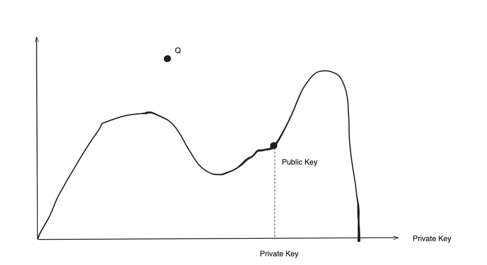

# Content/ 引文

本节我们来学习一种特殊的账户—程序派生账户 PDA。

### 什么是 PDA？

在Solana区块链中，PDA指的是“程序派生地址”（Program Derived Address）。这是一种特殊类型的地址，由 Solana 的程序生成，而不是由用户的私钥直接派生。***PDA的主要目的是允许程序拥有和控制某些数据或资产，而不需要传统的私钥签名***。

读到这还一头雾水吗，没关系让我们把这个概念拆开做更详细的解释。

### 私钥、公钥与助记词

Solana 和以太坊一样，有私钥、公钥、助记词三种东西。私钥是私自保管不可示人的，当我们授权某一笔交易时，我们需要通过私钥签名并“授权”该交易。私钥是一串乱码，不好记，与之对应有一串助记词。助记词可以通过算法推出私钥，所以实际上我们在使用钱包时，只要记住助记词。而我们可以通过加密算法从私钥推算出公钥。公钥是可以展示给别人看的，别人通过你的公钥给你转账，同时公钥也是程序的地址，也叫 `program_id`。

要注意的是我们只能从助记词通过加密算法推算出私钥，从私钥推算出公钥，而无法反向从公钥推算出私钥，从私钥推算出助记词。否则我们所有加密地址中的代币都可以被任何人控制了。这其中的过程通过`ECDSA`算法进行计算，如果希望了解具体的原理可以先从了解 `ECDSA`算法开始。但是理解 PDA 账户可以不必这么深入，让我们先把这个过程进行一个简化。



如上图所示（这是一个简化的图示），每一个 X 轴私钥会在曲线上对应一个 Y轴公钥，***但是 Q 点的  公钥没有对应任何一个 X 轴上的私钥。那么这就意味着这个公钥没有对应的私钥！***这意味着这个公钥不是从私钥派生/衍生（Secret Key Derived）出来的。

这就是 PDA 的原理，“程序派生地址”（Program Derived Address）是没有对应的私钥的，它是由一个程序的`program_id`和`seed`派生/衍生出来的，这也是为什么它被称之为“程序派生地址”（Program Derived Address）。有时候我们通过 program_id 和 seed 获得的公钥正好有对应的私钥，那么这种情况下我们就需要重新生成一个公钥，通常是在我们的 program_id 和 seed 之外再加上一个数字（这个数字有个专有名词叫 `bump`），这个数字从 255 开始，依次往下，直到生成的公钥没有私钥为止。

### 那我们为什么需要 PDA

在区块链中，你需要一个私钥来证明你拥有一个公钥的所有权，同时你才能签字同意这个账户的转账请求。但如果这个账户的所有者不是一个人而是一个去中心化程序，那么把私钥放在这个程序上就不是一个好主意，因为所有程序代码都在链上都是公开的，如果所有人都能看到你的私钥，那么人们就能进行一些恶意操作，比如偷走你的代币。这时我们就需要一个没有私钥的 PDA。 这样程序不需要私钥就能对一个地址进行签名操作。

### 如何生成 PDA 地址

这里我们使用 Solana 的`Anchor`开发框架，实现 PDA 账户的初始化（Anchor 框架我们会在后续章节专门介绍，这里只是让大家简单了解下 PDA 账户的生成过程）。

```jsx
// PDA 账户存储的数据
pub struct Counter {
    count: u64
}
```

这个 PDA 账户存储的是`Counter`结构的数据，它包含了一个`u64`类型的`count`值。

```jsx
pub struct InitializeAccounts<'info> {
		#[account(
			init, 
			seeds = [b"my_seed", 
							 user.key.to_bytes().as_ref()
							]
			bump,
			payer = user, 
			space = 8 + 8
		)]
		pub pda_counter: Account<'info, Counter>,
}
```

其中的`pda_counter`字段为要生成的PDA 账户，我们标记了初始化时用到的`seeds`值及`bump`，其中的 seeds 可以是根据业务场景设置的任意字节数组，Anchor 默认使用符合条件的第一个 bump 值，不需要我们手动指定，同时Anchor 内部也会自动获取`program_id`，同样不需要我们手动指定。

但是我们需要指定账户所占用的空间大小`space`以及支付初始化交易费的账户`payer`。这里指定账户的空间大小为16个字节，前 8 个字节存储 Anchor 自动添加的鉴别器，用于识别帐户类型。接下来的 8 个字节为存储在`Counter`帐户类型中的数据分配空间（`count`为 u64 类型，占用 8 字节），space 主要用于计算账户在网络中的租金。

以上就是生成 PDA 账户的部分代码示意，虽然并不完整，但向我们展示了 PDA 账户涉及到的相关内容：program_id 程序ID、seed 种子、bump 值、space 空间。后续章节会进行详细的介绍。