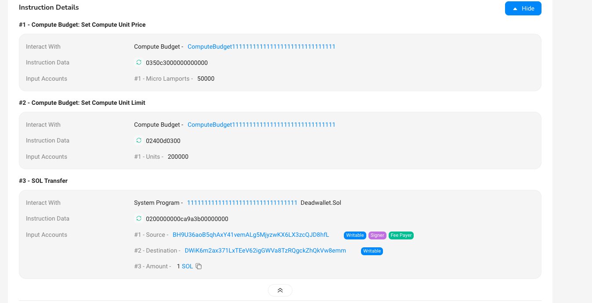
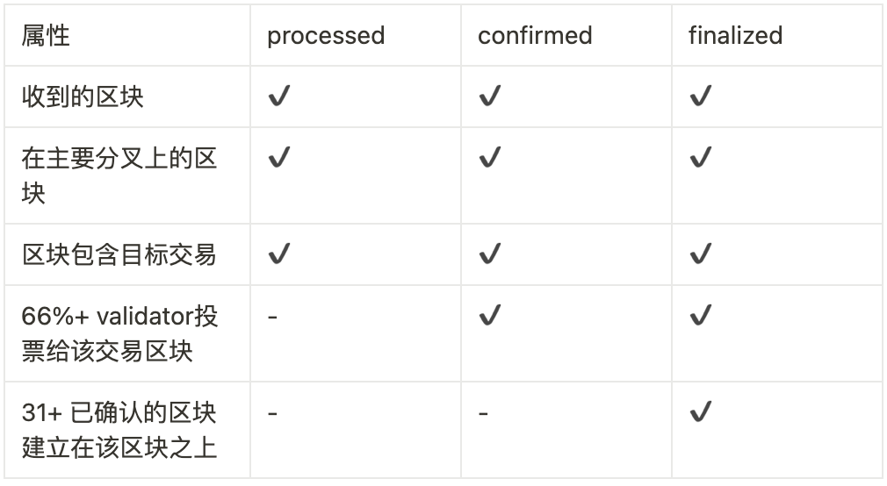

# Content/ 引文

### 交易费用

我们在上一章提到什么是交易与指令，那么执行一个交易就需要 **Compute unit。**

如果你熟悉 EVM，**CU(Compute unit)**就像是gas fee

当然如果你不熟悉也没关系，Solana 就像个由多个节点连接组成的公共巨型计算机，节点运行者往往需要投入大量的物理资源(如CPU, GPU)来维持巨型计算机的稳定运行，为了奖励节点运行者处理链上大量的交易维持网络的稳定，gas费将做为他们贡献的补偿。

当然 CU 的存在还有一些别的目的，比如：

1. 通过对交易引入实际成本，减少网络垃圾
2. 设定每笔交易的最低费用金额，为网络提供长期的经济稳定性

因此，当用户在链上发送一笔交易时，往往需要支付一笔手续费用于处理交易中所包含的指令。

- 以下的一些操作会产生 **Compute unit**：
    - 执行SBF指令
    - 在程序之间传递数据
    - 调用系统调用
    - 记录日志
    - 创建程序地址
    - 跨程序调用

### CU最大限制

由于每笔交易中所包含的指令调用数量和数据量的不同，每笔交易都设定了**最大的CU限制**——”**compute budget**”以确保单笔交易的数据量不会过大从而造成网络的拥堵。

每条指令的执行都会消耗不同数量的CU，在消耗了大量的CU后(即消耗的CU已经超出了”compute budget”所限定的最大CU)，指令运行将停止并返回错误，从而导致交易失败。

### 交易费

在一笔转账交易中，我们可以看到其中包含了对于**CU limit**和**CU price**的设置。

指令`Set Compute Unit Price`中，可以看到`compute budget` 程序将每CU的价格设定为 `50000` lamports (**1 SOL = 1000,000,000 lamports**)

指令`Set Compute Unit Limit`中，`compute budget`程序将该笔交易的CU消耗上限设置为**200,000.** 当一笔交易所有的指令CU消耗超过了200,000时，交易将会失败。

> 手续费的计算公式为: **CU数量 * CU价格 = 手续费用**
> 



### 交易的确认

一笔交易在根据在solana网络上的确认程度可以分为以下几类主要状态:

```jsx
'processed': 查询已通过连接节点获得1次确认的最新区块
'confirmed': 查询已通过集群获得1次确认的最新区块
'finalized': 查询已由集群完成的最新区块
```



| 属性 | processed | confirmed | finalized |
| --- | --- | --- | --- |
| 收到的区块 | ✔ | ✔ | ✔ |
| 在主要分叉上的区块 | ✔ | ✔ | ✔ |
| 区块包含目标交易 | ✔ | ✔ | ✔ |
| 66%+ validator投票给该交易区块 | - | ✔ | ✔ |
| 31+ 已确认的区块建立在该区块之上 | - | - | ✔ |