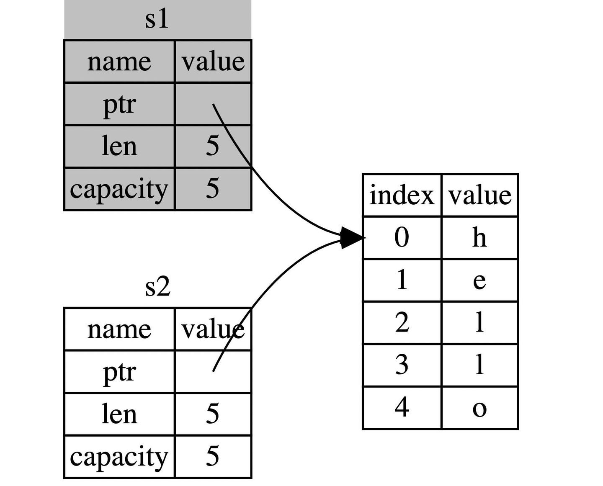

# Content/概念

这一节我们将学习Rust的一个重要特性：**所有权**，它让 Rust 无需垃圾回收器（garbage collector）即可保证内存安全。因此，理解 Rust 中所有权的运作方式非常重要。

**所有权**：Rust 中每个值都有一个唯一的所有者owner（如上节代码`let s1 = String::from("hello");`中，变量`s1`是`hello`这个值的所有者），所有者拥有这个值的所有权，负责管理内存资源的分配和释放。Rust 通过所有权机制规定内存管理的方式，确保程序在运行时不发生数据竞争、悬垂指针等内存安全问题。

**所有权三原则**：

1. Rust 中每一个值都被一个变量所拥有，该变量被称为值的所有者；
2. 一个值同时只能被一个变量所拥有，或者说一个值只能拥有一个所有者；
3. 当所有者(变量)离开作用域范围时，这个值将被 **drop** (丢弃)。
- 比喻
    
    Rust 中所有权的概念跟法律中的所有权概念是一脉相承的，就像房产证、车辆登记证、股票等这些都标识你拥有某个事物的所有权，负责管理这些东西，就像 Rust 中所有者负责管理这个值的内存——分配、使用、以及最终释放；当发生买卖时，前一个所有者不再有任何权利和责任，新的所有者接管所有的责任和控制权，就像 Rust 中，当值被转移（或称为“移动”）给另一个变量时，原来的所有者放弃对这个值的控制，这确保了每个时刻，每个值都只有一个清晰定义的所有者。
    
- 真实用例
    
    在实际的项目中通常遵循引用传递的模式，而不是直接的所有权转移，因为它可能导致不可预测的后果。所以在solana项目中我们看到的更多是通过 & 的引用。
    
    ```rust
    // 这里我们依旧是把 instruction_data 的引用，传递给内部函数
    pub fn unpack(instruction_data: &[u8]) -> Result<Self, ProgramError> {}
    ```
    

### Documentation

我们在下面的代码中展示所有权的**分配、修改**。

```solidity
// 变量 s1 拥有字符串 hello 的所有权
let mut s1:String = String::from("hello");

// 变量 s1 可以修改该字符串
s1.push_str(", hackquest."); // push_str() 在字符串后追加字面值
```

### FAQ

- **Q1：Rust 中变量的作用域是什么样的？**
    
    A：变量的有效范围从声明的地方开始，直到当前作用域的结束都是有效的，就这点而言跟其他编程语言是一样的。但是Rust 中在变量离开变量作用域后，不仅变量不再有效，同时还会**释放其内存**（如果该变量占用内存的话）。
    
    ```solidity
    fn main() {
        {                     // s1 在这里无效，它尚未声明
            let s1 = String::from("hello");  //从此处开始，s1有效
        }                     // 离开作用域，s1 无效，占用的内存也被释放
    
        {                     
            let s2 = "hello"; // 从此处起 s2 是有效的
            // do something using s2
        }                     // 此作用域已结束，s2不再有效，无需释放内存，
    													// 因为s2为字符串字面量，被硬编码到程序中
    }
    ```
    
- **Q2：Rust 中所有权转移（move）时，内存中是怎么变化的？**（结合右侧 Example 中的代码）
    
    A：字符串`hello`位于堆内存，变量`s1`拥有该值的所有权，这时由于 s1 把所有权转移给了`s2`，所以 s2 拷贝了一份 s1 的信息，并重新在栈内存中记录了字符串的指针、字符串长度及容量信息，这个操作也叫做**”浅拷贝“**，即只拷贝引用，不拷贝数据（上一节已介绍过）；按照所有权三原则第2条：**一个值只能拥有一个所有者**，此时 s1 失效，s2 拥有字符串的所有权。
    
    总的来说，所有权的转移（move）涉及2个部分：**浅拷贝** + **旧变量失去所有权**（这个是最容易被忽略的）。
    
    
    

# Example/示例代码

接下来我们学习下**所有权转移**在代码层面是如何实现的（Rust 中称之为 move，但翻译为“转移”其实更贴切），底层内存的变化请参照左侧FAQ中Q2。

```solidity
// 移动所有权
fn main() {
    let s1 = String::from("hello");
    
    // 这里s1把所有权转移给了变量s2，按照所有权三原则中的第2条，
		// 此时只有s2拥有所有权，也就意味着s1已失效
    let s2 = s1;
    
    // 在这里打印s1会失败，因为它已失效
    // println!("{}, world!", s1);

} //在这里触发所有权第3个原则，即 drop 掉s2变量，释放内存
```