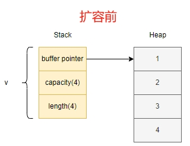

# Content/概念

上一节我们已经初步了解了“动态数组”的概念，接下来我们深入学习下。

**动态数组**`Vec<T>`是一种灵活的数据结构，允许在运行时动态改变大小。所以它的长度是可变的，可以根据需要动态增加或减少元素。这为处理不确定数量的数据提供了便利，比如读取未知数量的用户输入或动态生成数据集。

与`String`类型不同，动态数组`Vec<T>`是通用的，可以存储“任何类型”的元素，而 String 专门用于处理UTF-8编码的文本数据。动态数组 Vec 提供更灵活的操作，但在处理文本时，String提供了一些额外的字符串特定功能，例如字符串连接、切片等。选择使用动态数组 Vec 还是 String 取决于具体的需求和数据类型。

- 比喻
    
    生活中有很多事物具有类似于动态数组的特性，比如购物袋： 想象一个可以随时调整大小的购物袋。你可以根据购物需求，随时往里面加入或取出物品，而不需要提前确定购物袋的大小。又或者播放列表： 在音乐或视频播放列表中，你可以根据喜好不断添加或删除曲目，而不受歌单大小的限制，这种灵活性类似于动态数组的可变性，支持在运行时调整大小。
    
- 真实用例
    
    solana交易中的`instruction`指令数据，即调用程序（智能合约）时的参数是可变的，因此用动态数组表示：
    
    ```rust
    // solana_program::instruction::Instruction
    
    pub struct Instruction {
        pub program_id: Pubkey,
        pub accounts: Vec<AccountMeta>,
    		// 传递给程序的参数，为 u8 类型的动态数组
        pub data: Vec<u8>,
    }
    ```
    

### Documentation

下面的代码展示了5种创建动态数组的不同方式。

```solidity
// 1.显式声明动态数组类型
let v1: Vec<i32> = Vec::new();

// 2.编译器根据元素自动推断类型，须将 v 声明为 mut 后，才能进行修改。
let mut v2 = Vec::new();
v2.push(1);

// 3.使用宏 vec! 来创建数组，支持在创建时就给予初始化值
let v3 = vec![1, 2, 3];

// 4.使用 [初始值;长度] 来创建数组，默认值为 0，初始长度为 3
let v4 = vec![0; 3];  // v4 = [0, 0, 0];

// 5.使用from语法创建数组
let v5 = Vec::from([0, 0, 0]);
assert_eq!(v4, v5);
```

### FAQ

Q：动态数组`Vector`在内存中的结构是什么样的，如何进行动态调整的？

```jsx
fn main() {
    let mut v: Vec<i32> = vec![1, 2, 3, 4];
    //prints 4，即数组的初始容量是4
    println!("v's capacity is {}", v.capacity());
    // 打印内存地址
    println!("Address of v's first element: {:p}", &v[0]);
    
    v.push(5);
    //prints 8，数组进行扩容，容量变成8
    println!("v's capacity is {}", v.capacity());
    // 打印扩容后的内存地址，会发现跟上面的地址并不相同
    println!("Address of v's first element: {:p}", &v[0]);
}
```

初始时动态数组v的容量是4，堆内存中存储数值，栈内存中记录了堆内存的地址指针、数组容量及数组大小，当添加新元素5时，数组进行扩容，重新申请一块 2 倍大小的内存（即8），再将所有元素拷贝到新的内存位置，同时更新指针数据，这时数组大小是5，容量大小是8。




# Example/示例代码

我们在下面的代码中展示了数组`Vector`的一些常用操作（访问、修改、插入、删除等）。

```solidity
fn main() {
    let mut v1 = vec![1, 2, 3, 4, 5];

    // 通过 [索引] 直接访问指定位置的元素
    let third: &i32 = &v1[2];
    println!("第三个元素是 {}", third);

    // 通过 .get() 方法访问，防止下标越界
    // match属于模式匹配，后续章节会有详细介绍
    match v1.get(2) {
        Some(third) => println!("第三个元素是 {third}"),
        None => println!("指定的元素不存在"),
    }

    // 迭代访问并修改元素
    for i in &mut v1 {
        // 这里 i 是数组 v 中元素的可变引用，通过 *i 解引用获取到值，并 + 10
        *i += 10
    }
    println!("v1 = {:?}", v1);    // v1 = [11, 12, 13, 14, 15]

    let mut v2: Vec<i32> = vec![1, 2];
    assert!(!v2.is_empty()); // 检查 v2 是否为空
    v2.insert(2, 3); // 在指定索引插入数据，索引值不能大于 v 的长度， v2: [1, 2, 3]
    assert_eq!(v2.remove(1), 2); // 移除指定位置的元素并返回, v2: [1, 3]
    assert_eq!(v2.pop(), Some(3)); // 删除并返回 v 尾部的元素，v2: [1]
    v2.clear(); // 清空 v2, v2: []
}
```