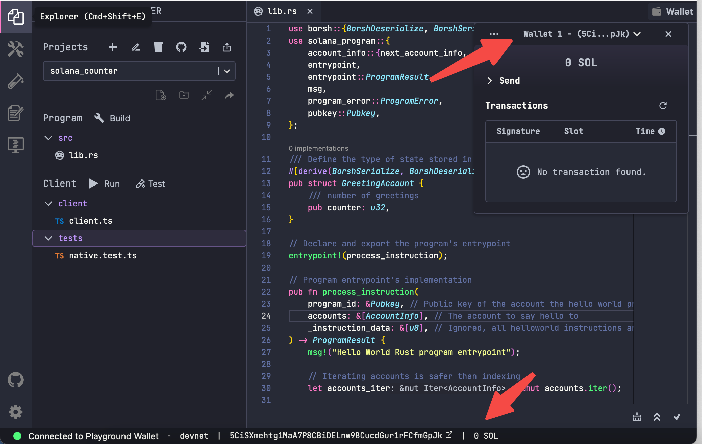

# Content

本节我们来学习下如何跟 Solana 程序交互：编译和部署。

这里要用到 Solana 的 [Playground](https://beta.solpg.io)，它是一个允许您从浏览器编写和部署 Solana 程序的 IDE 工具。

1、浏览器中打开该 IDE 后，左侧第1个icon为项目管理菜单，第2个icon为 Solana 程序的编译和部署，左下角为网络及钱包信息。


2、在项目管理菜单中点击 ***Create a new project*** 创建新项目***solana_counter***，填入项目名称，在Choose a framework 中选择 ***Native（Rust）***，这里我们使用 Rust 来写一个原生的 Solana 程序（在后面的章节中会介绍 Anchor 框架），接下来就会创建我们的示例项目。


3、创建完成后会自动给出一个示例项目以及对应的测试脚本，***需要把右侧Example 的程序代码粘贴进去***（它和默认的示例项目略有不同，请注意两者的区别）。


4、点击左下角链接 Solana 网络，如果之前没有创建wallet 钱包，Playground 会自动为我们创建，或者选择导入私钥生成我们指定的钱包。


5、界面的底部和右上角会展示连接的网络和钱包余额信息，如果是新钱包，此时余额为0。



6、在Solana 水龙头领取测试币，[地址在这里](https://faucet.solana.com/)，每小时最多领取 10 sol。


7、一切就绪，点击Build按钮对lib.rs中的程序源代码进行编译，编译信息会显示在下方，如果有错误，通过编译日志进行排查。编译成功后，我们就可以进行程序的部署了。


8、编译完成后，我们可以在左侧第二个菜单进行***deploy***部署（部署成功后，就会变成***Upgrade***按钮），并且在下方会显示部署的详情及结果，程序账户的地址为`CHZngDWtPLo9BmounNeLVuYtw6vjx6TMQ8J15LwMWPpq`。


9、部署成功后，我们可以在 Solana 区块链浏览器中查看[该笔交易信息](https://explorer.solana.com/tx/n4rQU85FmLjB82RAkRvRwj9jYYSseUYfvRi4jY6ZpxuoNGd8qFCiV4UsDbyKVviY5GWcBm7hwNVzMvr5JhvYaux?cluster=devnet)。其中`5CiS...`为我们的wallet钱包公钥，而`CHZn.…`为程序账户，它具有`executable`可执行属性，并且`updateable`可升级，该程序ID下对应的`7Lxk…`账户存储了程序的二进制文件（请注意：二进制文件并不是直接存储在程序账户中，而是下面的子账户中）。


这里展示了程序账户和子账户（存储程序二进制文件）之间的关系。


下一节，我们展示如何程序的调用。

# Example/示例代码

这里展示了用 Solana 实现的计数器程序。

```rust
use borsh::{BorshDeserialize, BorshSerialize};
use solana_program::{
    account_info::{next_account_info, AccountInfo},
    entrypoint,
    entrypoint::ProgramResult,
    msg,
    program_error::ProgramError,
    pubkey::Pubkey,
};

/// 定义数据账户的结构
#[derive(BorshSerialize, BorshDeserialize, Debug)]
pub struct CounterAccount {
    pub count: u32,
}

// 定义程序入口点函数
entrypoint!(process_instruction);

pub fn process_instruction(
		// 程序ID，即程序地址
    program_id: &Pubkey,
		// 该指令涉及到的账户集合
    accounts: &[AccountInfo],
		// 指令数据
    _instruction_data: &[u8],
) -> ProgramResult {
    msg!("Hello World Rust program entrypoint");

    // 账户迭代器
    let accounts_iter = &mut accounts.iter();

    // 获取调用者账户
    let account = next_account_info(accounts_iter)?;

    // 验证调用者身份
    if account.owner != program_id {
        msg!("Counter account does not have the correct program id");
        return Err(ProgramError::IncorrectProgramId);
    }

    // 读取并写入新值
    let mut counter = CounterAccount::try_from_slice(&account.data.borrow())?;
    counter.count += 1;
    counter.serialize(&mut *account.data.borrow_mut())?;

    Ok(())
}
```