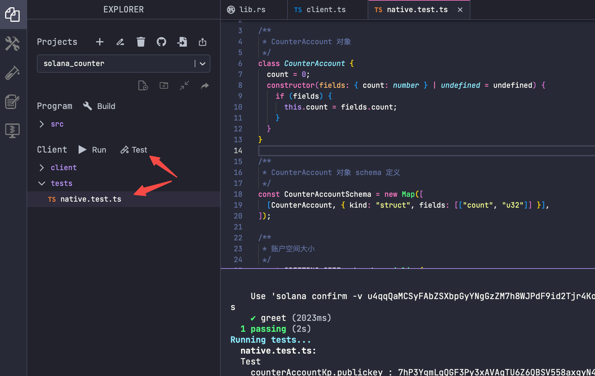

# 测试（1）

# Content

本节我们来学习下如何使用测试脚本调用该 Solana 程序。

在左侧的`Client`→`tests`菜单下，填入我们的`typescript`测试脚本（脚本在右侧Example中），单击`Test`按钮执行测试。



在测试脚本中，我们主要做了以下几件事情：

### 创建计数器对象

这里定义了一个`CounterAccount`类，并使用构造函数初始化对象实例。创建了一个`CounterAccountSchema`对象，该对象定义了`CounterAccount`类的序列化规则。接下来计算了序列化一个`CounterAccount`对象所需的字节数`GREETING_SIZE`，这个值将用于后续创建账户时确定账户空间的大小。

### 创建数据账户

```jsx
// 创建 keypair
const counterAccountKp = new web3.Keypair();
console.log(`counterAccountKp.publickey : ${counterAccountKp.publicKey}`)
const lamports = await pg.connection.getMinimumBalanceForRentExemption(
	GREETING_SIZE
);

// 创建生成对应数据账户的指令
const createGreetingAccountIx = web3.SystemProgram.createAccount({
	fromPubkey: pg.wallet.publicKey,
	lamports,
	newAccountPubkey: counterAccountKp.publicKey,
	programId: pg.PROGRAM_ID,
	space: GREETING_SIZE,
});
```

- 创建了一个新的 Solana Keypair (`counterAccountKp`) 用于存储计数器的状态。
- 使用 Solana API 获取在链上创建相应账户所需的最小 lamports，即Solana 链上存储该账户所要支付的最小押金`rent`。
- 构建`createGreetingAccountIx`指令，在链上创建我们指定的`counterAccountKp.publicKey`账户，并指定了账户的大小。

### 调用 Solana 程序

接下来我们创建如下指令，调用之前部署的 Solana 程序，并传入对应的数据账户`counterAccountKp.publicKey`来存储计数器状态，计数器程序会在该账户data的基础上累加，因此计数器从初始值0变为1。

```jsx
const greetIx = new web3.TransactionInstruction({
  keys: [
    {
      pubkey: counterAccountKp.publicKey,
      isSigner: false,
      isWritable: true,
    },
  ],
  programId: pg.PROGRAM_ID,
});
```

### 查看程序执行结果

调用`getAccountInfo`函数获取指定地址的数据，通过反序列化就可以把二进制数据转换成我们的计数器对象，此时它的值为1。

```jsx
    // 获取指定数据账户的信息
    const counterAccountOnSolana = await pg.connection.getAccountInfo(
      counterAccountKp.publicKey
    );

    // 反序列化
    const deserializedAccountData = borsh.deserialize(
      CounterAccountSchema,
      CounterAccount,
      counterAccountOnSolana.data
    );

    // 判断当前计数器是否累加
    assert.equal(deserializedAccountData.count, 1);

```

# Example/代码示例

以下为`native.test.ts`测试脚本完整内容，需要放在`Client→tests`文件夹下。

```tsx
// No imports needed: web3, borsh, pg and more are globally available

/**
 * CounterAccount 对象
 */
class CounterAccount {
  count = 0;
  constructor(fields: { count: number } | undefined = undefined) {
    if (fields) {
      this.count = fields.count;
    }
  }
}

/**
 * CounterAccount 对象 schema 定义
 */
const CounterAccountSchema = new Map([
  [CounterAccount, { kind: "struct", fields: [["count", "u32"]] }],
]);

/**
 * 账户空间大小
 */
const GREETING_SIZE = borsh.serialize(
  CounterAccountSchema,
  new CounterAccount()
).length;

describe("Test", () => {
  it("greet", async () => {
    // 创建 keypair
    const counterAccountKp = new web3.Keypair();
    console.log(`counterAccountKp.publickey : ${counterAccountKp.publicKey}`)
    const lamports = await pg.connection.getMinimumBalanceForRentExemption(
      GREETING_SIZE
    );

    // 创建生成对应数据账户的指令
    const createGreetingAccountIx = web3.SystemProgram.createAccount({
      fromPubkey: pg.wallet.publicKey,
      lamports,
      newAccountPubkey: counterAccountKp.publicKey,
      programId: pg.PROGRAM_ID,
      space: GREETING_SIZE,
    });

    // 调用程序,计数器累加
    const greetIx = new web3.TransactionInstruction({
      keys: [
        {
          pubkey: counterAccountKp.publicKey,
          isSigner: false,
          isWritable: true,
        },
      ],
      programId: pg.PROGRAM_ID,
    });

    // 创建交易，包含如上2个指令
    const tx = new web3.Transaction();
    tx.add(createGreetingAccountIx, greetIx);

    // 发起交易，获取交易哈希
    const txHash = await web3.sendAndConfirmTransaction(pg.connection, tx, [
      pg.wallet.keypair,
      counterAccountKp,
    ]);
    console.log(`Use 'solana confirm -v ${txHash}' to see the logs`);

    // 获取指定数据账户的信息
    const counterAccountOnSolana = await pg.connection.getAccountInfo(
      counterAccountKp.publicKey
    );

    // 反序列化
    const deserializedAccountData = borsh.deserialize(
      CounterAccountSchema,
      CounterAccount,
      counterAccountOnSolana.data
    );

    // 判断当前计数器是否累加
    assert.equal(deserializedAccountData.count, 1);
  });
});
```
