# Content/交互

在完成代码逻辑的编写后，接下来，我们将把程序部署到solana上，进行我们的solana开发部分。本节中，我们使用 Solana 官方提供的 [playgroud](https://beta.solpg.io/) 。这个平台让我们的部署和测试过程变得更加简便高效。

- **Step 1**
    
    第一步，我们先创建一个 Anchor 框架的 Solana 项目。
    
    
    
    在项目创建后，我们生成了三个文件。
    
    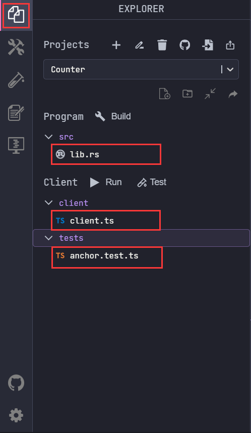
    
    - **lib.rs** : 在这儿定义 Rust 项目核心代码逻辑
    - **client.ts** : 在这儿定义与 Solana 程序交互的逻辑。它通常包括发送交易、从区块链获取数据和处理用户交互的功能。
    - **anchor.test.ts** : 顾名思义，很显然，这个文件与 Anchor 框架相关，用于编写和运行 Solana 程序的测试。
- **Step 2**
    
    第二步，我们需要创建一个 Playground钱包 并领取 sol 方便后续操作（在Solana 上部署程序是需要消耗资源的 ）。
    
    1. 点击创建新的密钥对生成钱包。
        
        !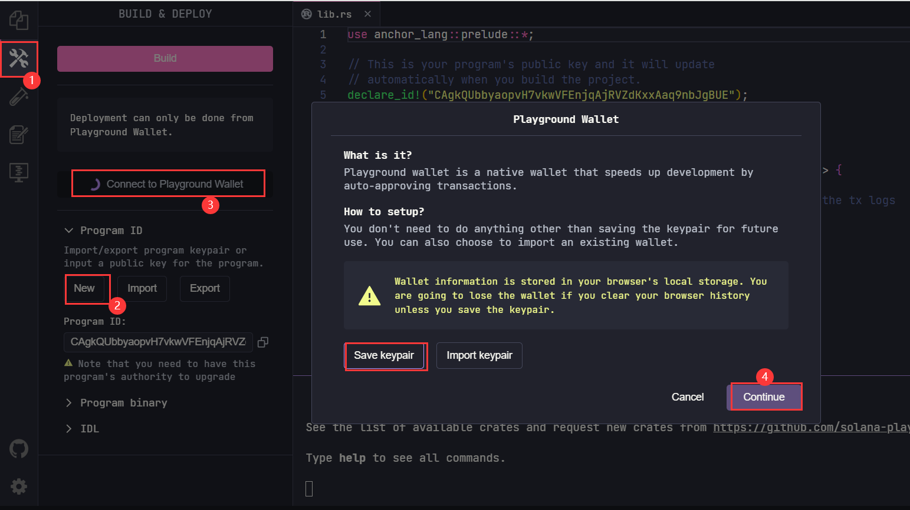
        
    2. 点击右上角的 wallet 即可看到我们新生成的钱包（当然，目前是 0 sol） 
        
        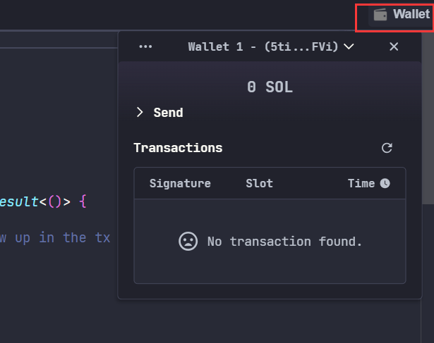
        
    3. 领取 sol , 我们有多种方法
        - 通过水龙头 [faucet](https://faucet.solana.com/) 领取
            
            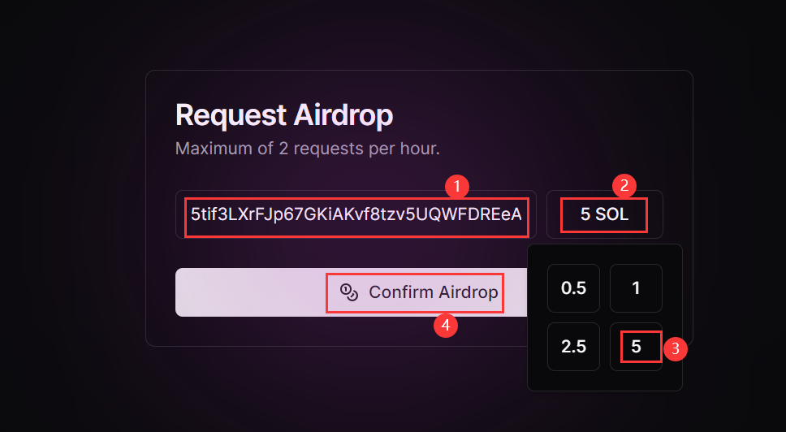
            
            
            
        - 在终端输入 **solana airdrop 5**
            
            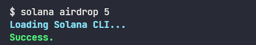
            
        - 拜托你的solana开发者朋友转一点给你（这里我们拜托了热心的Novar 老师）
        
        总之，在领取之后，我们有5个 sol 了！这足够我们完成一次部署测试的操作了！
        
        
        
    
- **Step 3**
    
    第三步，准备部署程序。
    
    1. 将 我们的 ***Counter*** 代码复制到 ***lib.rs***文件中
        
        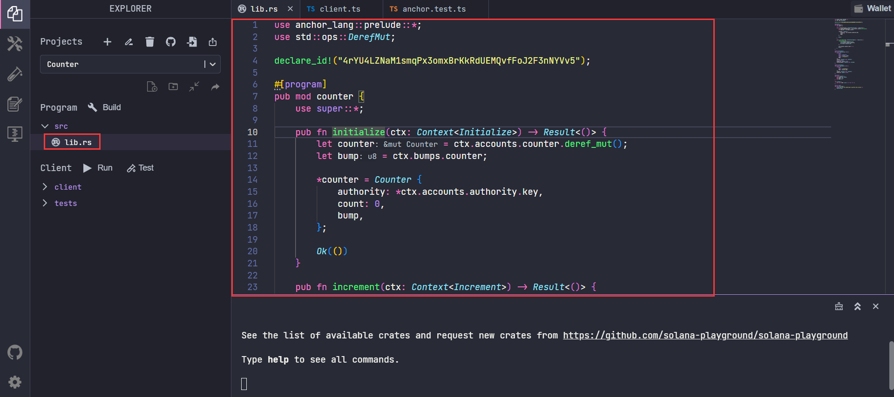
        
    2. 将client.ts 的示例代码复制进相应文件
        
        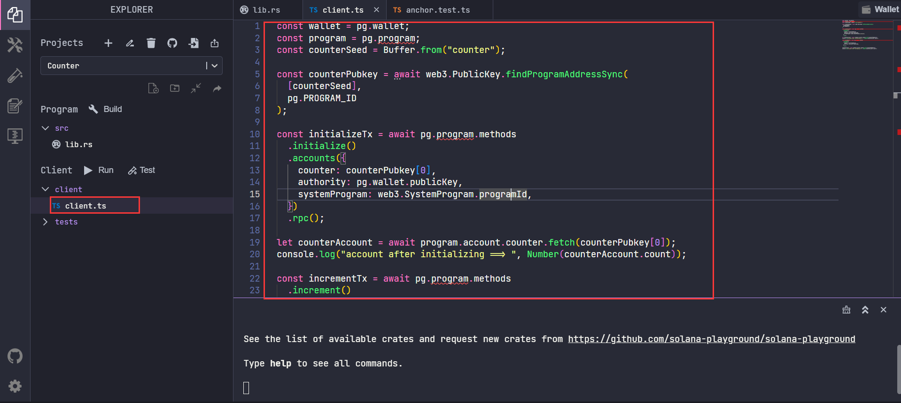
        
    3. 切换到左侧工具栏第二个按钮并点击 **build**
        
        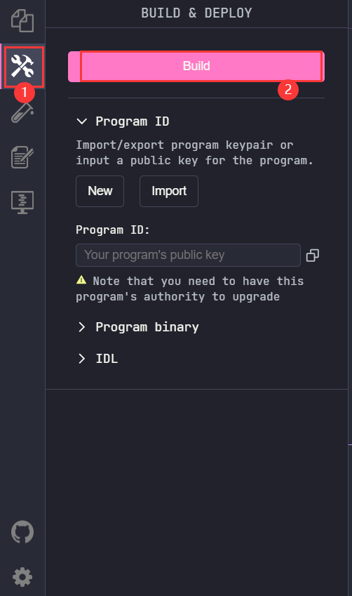
    4. 点击**deploy,** 终端出现 “*Deployment successful.*” 即为部署成功。（这大约会消耗2~3个sol）
        
        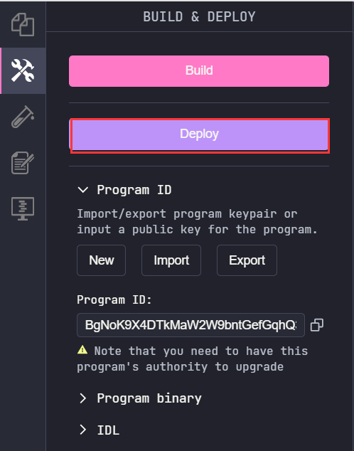

        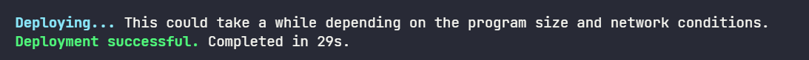
- **Step 4**
    
    第四步，运行 ***client.ts*** 交互文件
    
    1. 切换到左侧第一个文件按钮并点击 **Run** 
        
        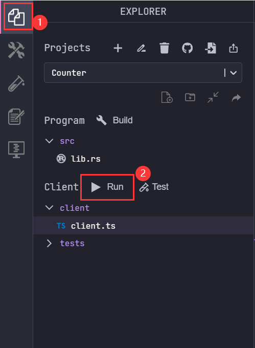
        
    2. 终端输出初始化及计数增加后的值
        
        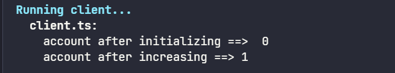
        

恭喜你🎉，完成本课程！

# Example/Code

**Counter code**

```rust
use anchor_lang::prelude::*;
use std::ops::DerefMut;

declare_id!("4rYU4LZNaM1smqPx3omxBrKkRdUEMQvfFoJ2F3nNYVv5");

#[program]
pub mod counter {
    use super::*;

    pub fn initialize(ctx: Context<Initialize>) -> Result<()> {
        let counter = ctx.accounts.counter.deref_mut();
        let bump = ctx.bumps.counter;

        *counter = Counter {
            authority: *ctx.accounts.authority.key,
            count: 0,
            bump,
        };

        Ok(())
    }

    pub fn increment(ctx: Context<Increment>) -> Result<()> {
        require_keys_eq!(
            ctx.accounts.authority.key(),
            ctx.accounts.counter.authority,
            ErrorCode::Unauthorized
        );

        ctx.accounts.counter.count += 1;
        Ok(())
    }
}

#[derive(Accounts)]
pub struct Initialize<'info> {
    #[account(
        init,
        payer = authority,
        space = Counter::SIZE,
        seeds = [b"counter"],
        bump
    )]
    counter: Account<'info, Counter>,
    #[account(mut)]
    authority: Signer<'info>,
    system_program: Program<'info, System>,
}

#[derive(Accounts)]
pub struct Increment<'info> {
    #[account(
        mut,
        seeds = [b"counter"],
        bump = counter.bump
    )]
    counter: Account<'info, Counter>,
    authority: Signer<'info>,
}

#[account]
pub struct Counter {
    pub authority: Pubkey,
    pub count: u64,
    pub bump: u8,
}

impl Counter {
    pub const SIZE: usize = 8 + 32 + 8 + 1;
}

#[error_code]
pub enum ErrorCode {
    #[msg("You are not authorized to perform this action.")]
    Unauthorized,
}
```

**client code**

```tsx
const wallet = pg.wallet;
const program = pg.program;
const counterSeed = Buffer.from("counter");

const counterPubkey = await web3.PublicKey.findProgramAddressSync(
  [counterSeed],
  pg.PROGRAM_ID
);

const initializeTx = await pg.program.methods
  .initialize()
  .accounts({
    counter: counterPubkey[0],
    authority: pg.wallet.publicKey,
    systemProgram: web3.SystemProgram.programId,
  })
  .rpc();

let counterAccount = await program.account.counter.fetch(counterPubkey[0]);
console.log("account after initializing ==> ", Number(counterAccount.count));

const incrementTx = await pg.program.methods
  .increment()
  .accounts({
    counter: counterPubkey[0],
    authority: pg.wallet.publicKey,
  })
  .rpc();

counterAccount = await program.account.counter.fetch(counterPubkey[0]);
console.log("account after increasing ==>", Number(counterAccount.count));
```