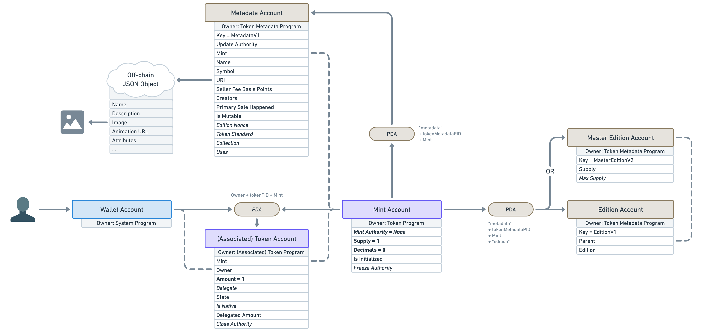

# Content/Master Edition Account

上节课我们已经学习了 **Metaplex** 的 **Metadata Account**， 它可以让我们把 NFT 元数据与 SPL Token 关联起来，这节课我们要学习 **Metaplex** 的另一个账户 — **Master Edition Account**，它用来管理 NFT 的增发。

**Master Edition Account**

在前面的学习中，我们知道了 Solana 上的 NFT 也是普通的 SPL Token，只是把供应量固定为 1，但如果有艺术家想把自己的一个作品发行 100 份，每一份有单独的版本号，也算是限量版的 1/1 NFT，那得怎么才能做到呢？

为此，**Metaplex** 引入了 **Master Edition Account** 来管理 NFT 的增发：

它同样是基于最初的 **Mint Account**，以 PDA 的方式推导出 **Master Edition Account** 地址，这样只要我们知道了 SPL Token ，也就可以知道其对应的 **Master Edition Account**。

它有 2 个关键的属性：

- **Supply**：当前供应量，也就是原版 NFT 被增发、复刻的次数。
- **Max Supply**：最大供应量，一旦供应量达到最大供应量，就不能再以这种方式铸造更多的 NFT。但请注意，如果 **Master Edition** 的 **Max Supply** 属性被设置为空，意味着这个 NFT 是可以被无限量增发的。

学习到这里，我们对 Solana NFT 的相关知识已经有了大致的了解，接下来就是我们的代码实践环节，让我们利用前面掌握的知识，一步步来完成我们的 NFT 项目吧。🚀🚀🚀