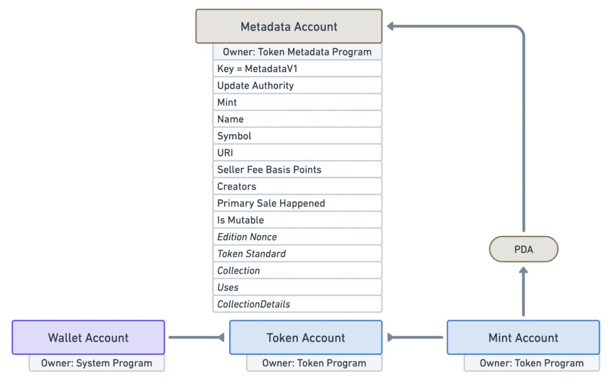

# Content/引文

**回顾前面关于 Solana NFT 基础：**

在 Solana 的世界似乎并没有一个类似 ERC721 这样被公认的 NFT 协议标准，而 Metaplex 则是其中一个目前最多被采用的 NFT 实现方案，它源自于 Solana Labs 的内部计划。Metaplex 本身可以理解为是制定了一系列标准的 NFT 工具平台，其中包括了一系列的智能合约，工具，甚至 UI，透过这些工具，可以让大家快速发布自己的 NFT。

这章我们将具体学习：

1. 定义与 NFT 相关的元数据属性
2. 创建元数据账户。

准备好了吗？让我们继续前进，深入 Solana NFT 开发的精彩世界！