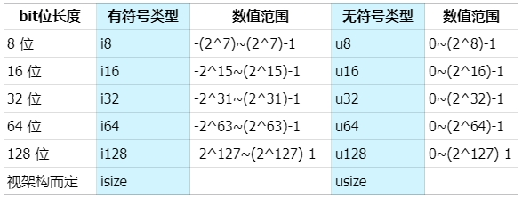

# Content/概念

Rust 基本数据类型中最常用的数值类型：有符号整数 (`i8`, `i16`, `i32`, `i64`, `isize`)、 无符号整数 (`u8`, `u16`, `u32`, `u64`, `usize`) 、浮点数 (`f32`, `f64`)。

**整数**是 没有小数部分的数字，具体有如下几种类型：



表示方式为 **有无符号 + 类型大小（位数）**，`i` 是英文单词 *integer* 的首字母，代表有符号类型，包含负整数、0和正整数，与之相反的是 `u`，代表无符号 `unsigned` 类型，包含0和正整数。Rust默认的整数类型是 `i32`，即用32个bit位表示有符号的整数。

**浮点类型数字** 是带有小数点的数字，在 Rust 中浮点类型数字也有两种基本类型： `f32` 和 `f64`，分别为 32 位和 64 位大小。默认浮点类型是 `f64`。

- 比喻
    
    在许多编程语言中都会把数值类型细分为许多种（如i8、i16、i32……），这么做的一个重要考量就是为了节省内存占用和性能优化。比如你要装1个苹果，可以选择放在手里、盘子、书包里，但如果用锅的话，是否是有点“大锅小用”。😂
    
- 真实用例
    
    solana 在调用链上程序（智能合约）时，传递的参数即为 u8 类型的数组。而原生代币`sol`则为 u64 位。
    
    ```rust
    pub fn process_instruction(
        program_id: &Pubkey,
        accounts: &[AccountInfo],
    		// 程序（智能合约）接收到的入参
        instruction_data: &[u8]
    ) -> ProgramResult {}
    
    // solana_program::native_token::LAMPORTS_PER_SOL
    pub const LAMPORTS_PER_SOL: u64 = 1_000_000_000;
    ```
    

### Documentation

我们在接下来看下数值的定义及表示方式。

```solidity
// 这里a为默认的 i32 类型
let a = 1;
// 可以指定也可以指定为具体的整数类型
let b: u32 = 1;

// 这里c为默认的 f64 类型
let c = 1.0;
// 也可以指定为具体的浮点数类型
let d: f32 = 1.0;

// Rust中可以方便的使用不同进制来表示数值，总有一款适合你
let x: i32 = 100_000_000;
let y: i32 = 0xffab;
let z: i32 = 0o77;
let m: i32 = 0b1111_0000;
let n: u8 = b'A';
println!("x = {}, y = {}, z = {}, m = {}, n = {}", x, y, z, m, n);
```

### FAQ

- Q1：isize 和 usize分别代表什么意思？
    
    A：`isize` 和 `usize` 类型取决于程序运行的计算机 CPU 类型： 若 CPU 是 32 位的，则这两个类型是 32 位的，同理，若 CPU 是 64 位，那么它们则是 64 位。
    

# Example/示例代码

Rust 支持所有数字类型的基本数学运算：加法、减法、乘法、除法和取模运算，但计算的变量必须是**相同的数据类型**。

```solidity
fn main() {
    // 加法，默认是i32
    let sum = 1 + 2;

    // 减法，默认是f64
    let difference = 1.1 - 2.2;

    // 乘法，默认是i32
    let mul = 2 * 50;

    // 除法，默认是f64
    let div = 1.1 / 2.2;

    // 求余，默认是i32
    let remainder = 11 % 5;

    println!("sum: {}, difference: {}, mul: {}, div: {}, remainder: {}", sum, difference, mul, div, remainder);

    // 编译器会进行自动推导，给予ferris i32的类型
    let ferris = 10;
    // 也可以通过类型标注，显式声明数据类型
    let ferris_one: i32 = 10;
    // 通过类型后缀的方式进行类型标注：10是i32类型
    let ferris_two = 10i32;

    // 只有同样类型，才能运算
    let addition = ferris + ferris_one + ferris_two;
    println!("{} + {} + {} = {}",ferris, ferris_one, ferris_two, addition);

    // 定义一个f32数组，其中12.0会自动被推导为f32类型
    let arr = [1.0, 1.1f32, 1.2_f32];
    // 打印数组中第一个值 arr[0]，并用 {:.2} 控制小数位为2位
    println!("{:.2}", arr[0]);
}

// 接下来我们看下 Rust 在遇到整数计算溢出时，都有哪些处理策略。

fn main() {
    // u32位无符号整数最大值
    let a: u32 = 4_294_967_295;
    let b: u32 = 1;
    // 输出结果
    println!("Original: {}", a);
    println!("Add 1: {}", b);

    // 使用 wrapping_* 方法在所有模式下都按照补码循环溢出规则处理，如果一个值超过最大值，它会从0开始重新计数。
    let result_wrapping = a.wrapping_add(b);
    // 返回 0
    println!("Wrapping Result: {}", result_wrapping);

    // saturating_* 在整数溢出时返回相应类型的最大值，如果是下溢，则返回最小值。
    let result_saturating = a.saturating_add(b);
    // 返回 4294967295
    println!("Saturating Result: {}", result_saturating);

    // checked_* 返回值为Option，溢出时为 None 值，否则为Some(result)。可以检查操作是否导致了溢出。
    let result_checked = a.checked_add(b);
    // 返回 None
    match result_checked {
        Some(result) => println!("Checked Result: {}", result),
        None => println!("Checked Result: Overflow!"),
    }

    // overflowing_* 返回值为(result, overflowed)，结果值和一个指示是否存在溢出的布尔值
    let (result_overflowing, overflowed) = a.overflowing_add(b);
    // 返回 (0, true)
    if overflowed {
        println!("Overflowing Result: Overflow!");
    } else {
        println!("Overflowing Result: {}", result_overflowing);
    }
    
}
```