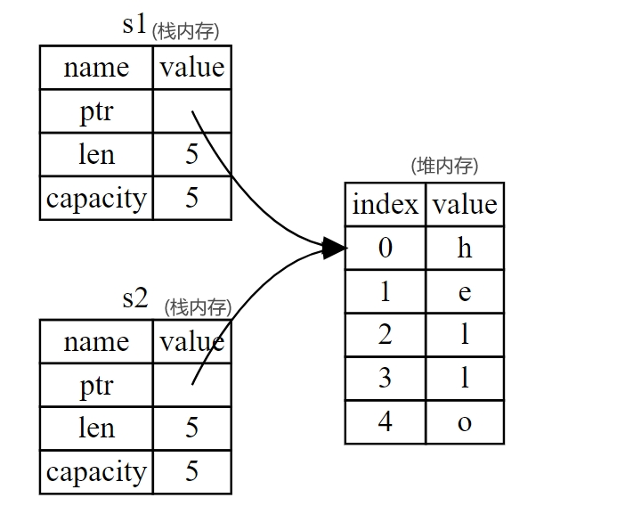

# Content/概念

> 前言：我们在前几节介绍过 Rust 的基础类型：`i32`、`char`、`f64`、`bool`等，它们都是已知大小的，存储在**栈内存**中。在接下来的 Rust **所有权**特性中会涉及到**堆内存**相关的知识，所以我们在这里使用 String 作为例子，并专注于 String 与所有权相关的部分，看下 Rust 如何在栈、堆内存中管理数据的。关于String类型更加深入的讲解会在第三章。
> 

这里我们先介绍下关于内存的2个基础知识：栈内存和堆内存，注意，这并不是 Rust 独有的。

**栈内存**存储的数据主要为大小固定的基础数据类型，分配和释放速度很快；它以放入值的顺序存储值并以相反顺序取出值。这也被称作 **后进先出**（*last in, first out*）。

**堆内存**存储那些大小在运行时动态变化的数据结构，允许更灵活的数据共享和动态分配；当向堆放入数据时，内存分配器（memory allocator）在堆的某处找到一块足够大的空位，把它标记为已使用，并返回一个表示该位置地址的 **指针**（*pointer*）。总的来说，堆、栈内存并无优劣之分，只是面向的场景不同而已。

**动态字符串（String类型）**： 大小可变的字符集合，这个类型允许程序在运行时动态的管理堆内存上的字符串数据，比如分配、增长和修改字符串内容，所以能够存储在编译时未知大小的内容。

- 比喻
    
    栈内存的使用方式就像叠盘子一样：当增加更多盘子时，把它们放在盘子堆的顶部，当需要盘子时，再从顶部拿走。不能从中间也不能从底部增加或拿走盘子；同时，栈内存存储的数据的大小像盘子一样，都是固定的，因此分配和释放都很快。而堆内存的使用方式就像往仓库中放入货物一样，入库前必须先清理出一片足够的区域，出库后这片区域又会被释放；同时，货物大小没有固定要求，只要仓库放得下即可。
    
- 真实用例
    
    内存是计算机宝贵的存储资源之一，对于区块链而言，存储同样重要，为了防止链上资源被滥用，solana 引入了`rent`的机制，即每个账户要为所占用的链上空间支付租金，租金则是根据占用的空间大小和时间共同决定的，但是如果你的账户余额大于2年的租金总额，solana 就不再收取 rent，这么来看，rent 更像是一个押金的概念。
    

### Documentation

通过下面的代码，我们看下动态字符串的创建。

```solidity
use std::io;
fn main() {
     // 创建一个可变的字符串变量来存储用户输入
    let mut input: String = String::new();
    println!("请输入您的名字:");
    // 读取用户输入并将其存储在 input 变量中
    io::stdin()
        .read_line(&mut input)
        .expect("无法读取输入");
    // 打印用户输入的字符串
    println!("您的名字是: {}", input);
}
```

### FAQ

- Q ：**Rust中动态字符串在内存中的结构是什么样的，发生拷贝时，内存有什么变化？**（请结合Example例子）
    
    **创建**动态字符串`hello`时，内存分配器会在**堆内存**中开辟一块空白的区域，当前为5个字节大小，用于存储`hello`的值。当把该动态字符串赋给变量`s1`时，`s1`会在**栈内存**中存储该字符串在堆内存空间中的信息，包含：堆内存的指针、字符串长度、开辟的堆内存容量大小。如下图所示：
    
    
    
    **克隆（深拷贝）**：假设这样一个场景：我们想要修改该字符串，但又不想影响其他使用该字符串的地方，那该怎么办？答案是：克隆，即把该字符串生成一个副本，对副本进行修改，这样就可以达到上述目的。克隆后在内存中的结构如下：
    
    
    
    但克隆会**对性能有影响**，尤其是对于执行较为频繁的代码(热点路径)或者克隆较大的内存对象时，使用 `clone` 会极大的降低程序性能。
    
    在其他编程语言中（如Java），还有一种**浅拷贝**的方式，即只拷贝**栈内存**中的数据，此时变量`s1`有了副本`s2`，但堆内存数据并没有复制，所以这种操作的效率非常高。但由于2个变量指向同一个堆内存，所以变量s1、s2都可以修改数据，造成数据竞争，因此需要非常谨慎。
    
    不过好在Rust有自己的处理机制**：所有权和借用**，我们会在接下来的章节介绍到。
    
    
    

# Example/示例代码

下面的代码展示了动态字符串的创建，以及克隆的代码示意。那它在内存中的结构是什么样的？请参见FAQ。

```rust
fn main() {
    // 动态字符串
    let s1 = String::from("hello");
    
    // 克隆，把变量s1在堆内存的数据，复制了一份，存储在新开辟的内存空间中
    // 变量s3在栈内存中记录了新空间的位置、长度、大小信息
    let s3 = s1.clone();
    println!("s1 = {}, s3 = {}", s1, s3);
}
```