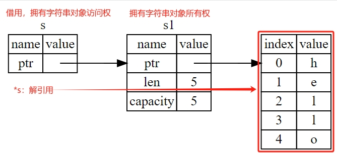

# Content/概念

> 前言：在上节我们介绍了 Rust 的所有权以及所有权的转移，但是仅仅支持通过转移所有权的方式获取一个值，会让程序变得复杂。那么，接下来我们学习下Rust中的另一特性：借用
> 

**借用(Borrowing)** ：是指通过引用来获得数据的**访问权**，而不是所有权，用符号`&`表示。借用使得可以在不转移所有权的情况下，让多个部分同时访问相同的数据。Rust 的借用分为**可变借用（mutable borrowing）**和**不可变借用（immutable borrowing）**两种形式。

**解引用：**是借用的一个重要操作，允许通过引用获取到被引用值的实际内容，简单来说，就是获取到借用的对象的值。用符号`*`表示。

- 比喻
    
    在所有权的背景下，“借用”其实很好理解，就如同你名下有一辆车，那你就拥有这辆车的所有权，你把车借给朋友开，他用完还要还给你，这就是“借用”，同时呢，他把车开到大街上向别人炫耀下他借到了一辆特别酷炫的车，这就是“解引用”。
    
- 真实用例
    
    在 solana 程序的入库函数中，入参均为借用（引用）类型
    
    ```rust
    entrypoint!(process_instruction);
    
    pub fn process_instruction(
    	// 程序地址的引用
      program_id: &Pubkey,
    	// 指令涉及到的账户数组的引用
      accounts: &[AccountInfo],
    	// 参数的引用
      instruction_data: &[u8]
    ) -> ProgramResult {}
    ```
    

### Documentation

我们还是从代码和内存两个角度展示下**借用、解引用**的相关概念。

```rust
// 变量s1拥有字符串的所有权，类似于你拥有一辆特别酷炫的车
let s1 = String::from("hello");

// 借用，通过 &s1 获得字符串的访问权，类似于朋友从你那里把这辆车借走了
// 但是车还是你的
let s: &String = &s1;

// 解引用，通过 *s 获的借用的对象的值
// 类似于你朋友把车开到大街上向别人展示：看，我借到了一辆特别酷炫的车！
println!("s1 = {}, s = {}", s1, *s);
```

通过一下的图示，我们会发现**借用**其实就是存储了字符串对象的内存地址指针，所以用更宽泛的概念来说，借用也是一种**引用**。



### FAQ

# Example/示例代码

这里我们学习下什么是**不可变引用（借用）、可变引用与悬垂引用**。

```solidity
// 不可变引用，获取值的长度
fn calculate_length(s: &String) -> usize {
    s.len()
}

// 可变引用
fn change(some_string: &mut String) {
    some_string.push_str(", hackquest.");
}

// 悬垂引用（编译不通过）
fn dangle() -> &String {
    // 创建拥有字符串所有权的变量s
    let s = String::from("hello");

    // 返回对象的借用
    &s
    
} //离开函数体作用域后，变量s的内存空间会被自动释放掉，此时&s就成为无效指针（悬垂引用），因此，
  //会编译失败

fn main() {
    let s1 = String::from("hello");

    // &s1 即不可变引用（默认），也就是在函数中我们只能读取对象，而不能修改对象
    let len = calculate_length(&s1);
    println!("The length of '{}' is {}.", s1, len);

    let mut s2 = String::from("hi");
    // &mut s2 即可变引用，所以 change 函数可以修改该值
    let r1 = &mut s2;
    change(r1);

    // 试图访问悬垂引用的对象，编译失败
    // let reference_to_nothing = dangle();
}
```